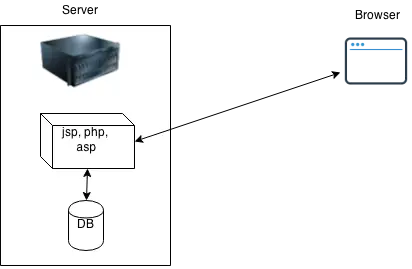
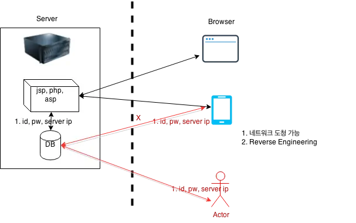

# Mobile Service Architecture
* No direct connect to database server
* Every app is exposed to be decompiled and packet monitored
* use middleware server or api gateway

* Legacy web

* Secure, Insecure

## ref
* https://okdevtv.com/mib/android
