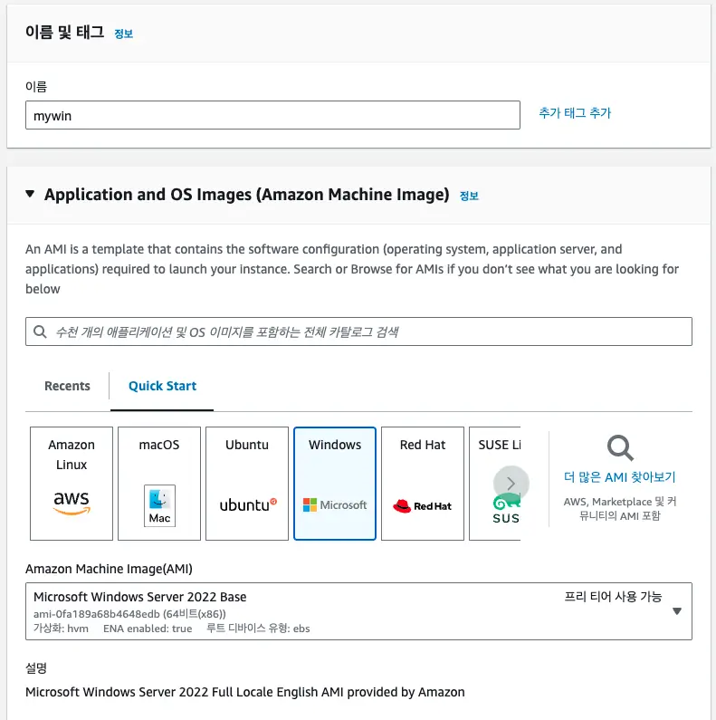
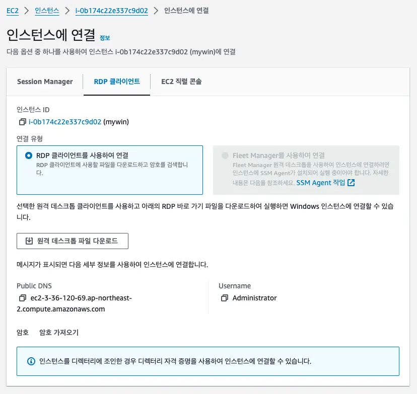
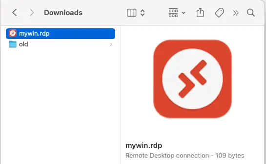

# AWS EC2 Windows
- Windows Server 2022
- 60GB SSD(WinSXS issue)

## RDP
- Remote Desktop Protocol: 3389

## How to
- 
- 
- 
- 
- 
- 
- 
- 
- 

## Install for dev
- git https://git-scm.com
- zsh, oh-my-zsh
- java, maven, gradle with sdkman
- vscode
- docker
