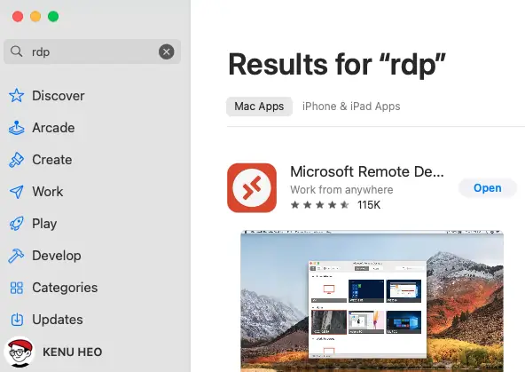
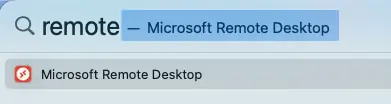
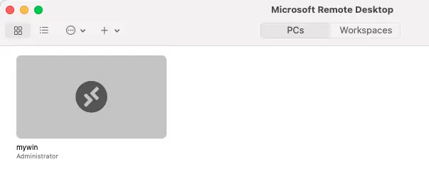
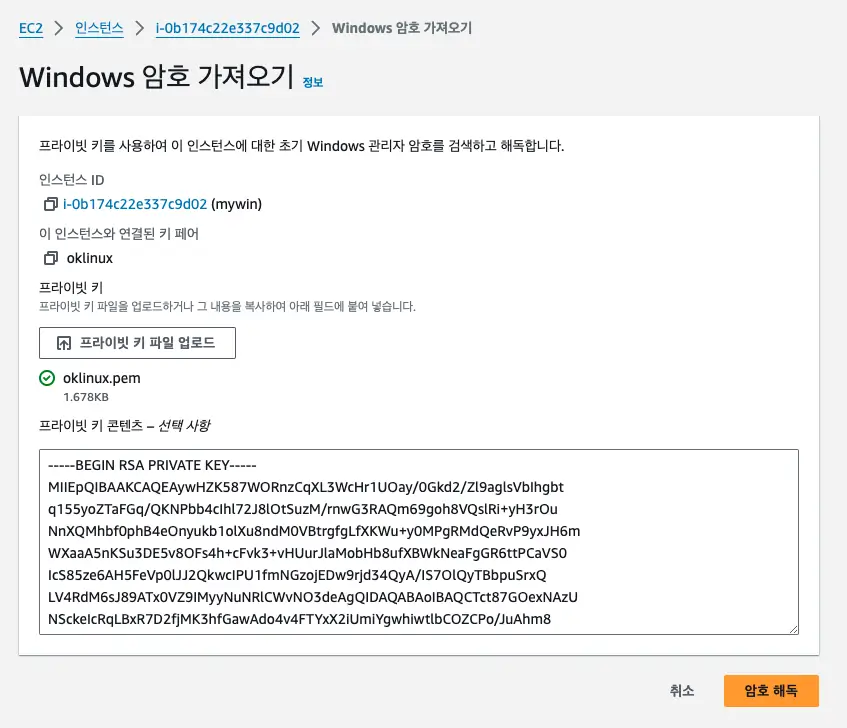
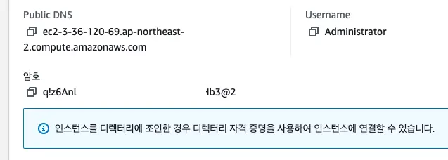
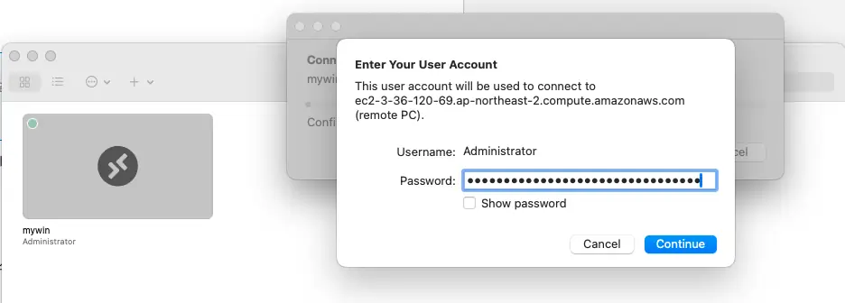

# AWS EC2 Windows

- Windows Server 2022
- 60GB SSD(WinSXS issue)

## RDP

- Remote Desktop Protocol: 3389

## How to

- 
- 
- 
- 
- 
- 
- 
- 
- 

## Install for dev

- git https://git-scm.com
- zsh, oh-my-zsh
- java, maven, gradle with sdkman
- vscode https://code.visualstudio.com/download
- docker
```

```
