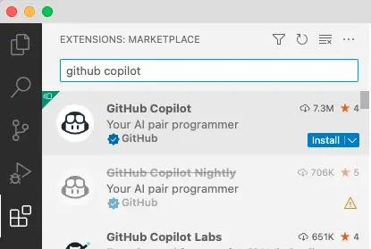
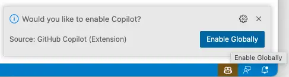
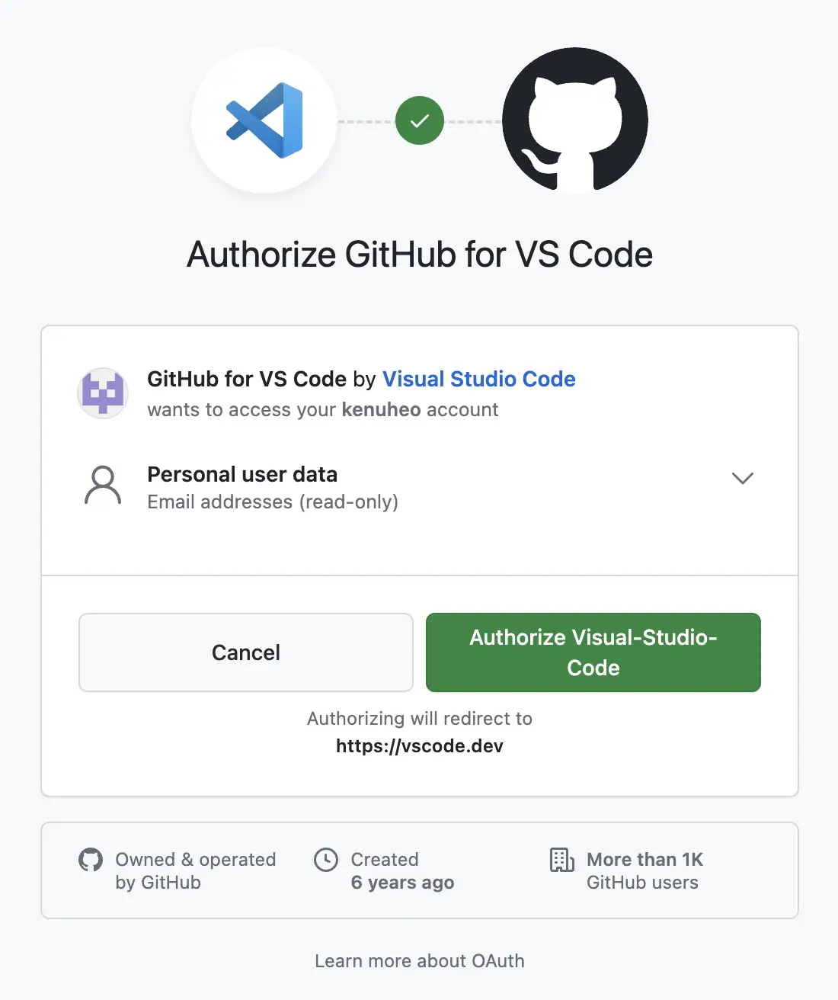
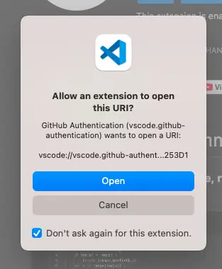
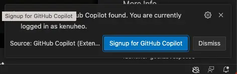
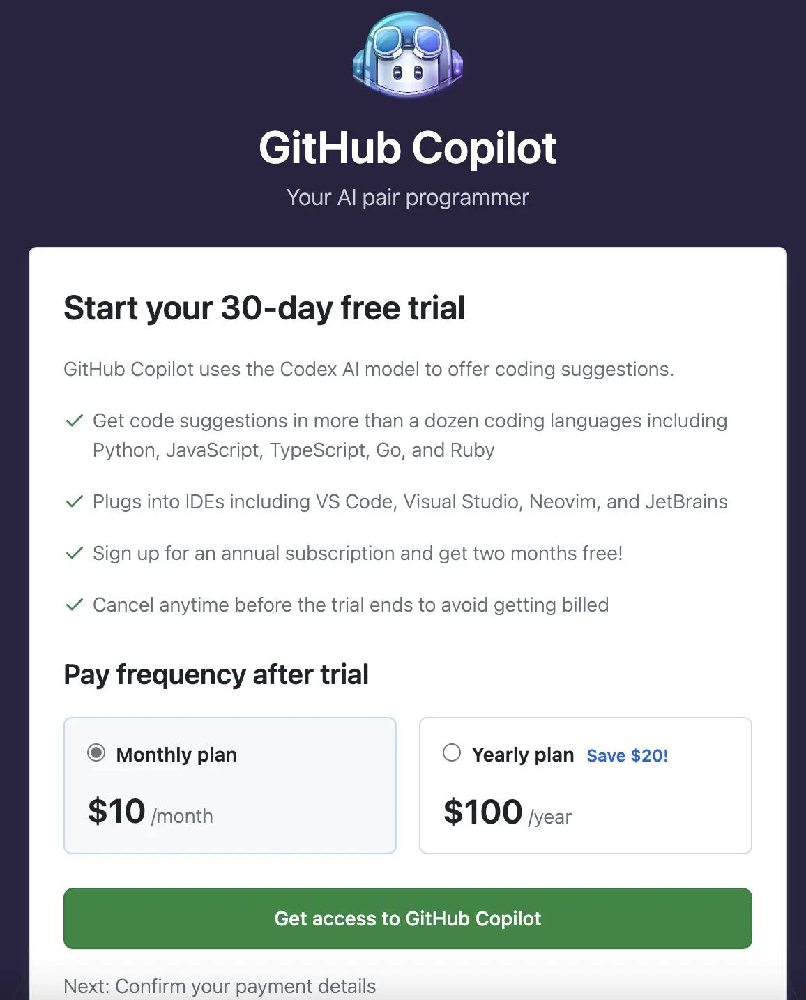
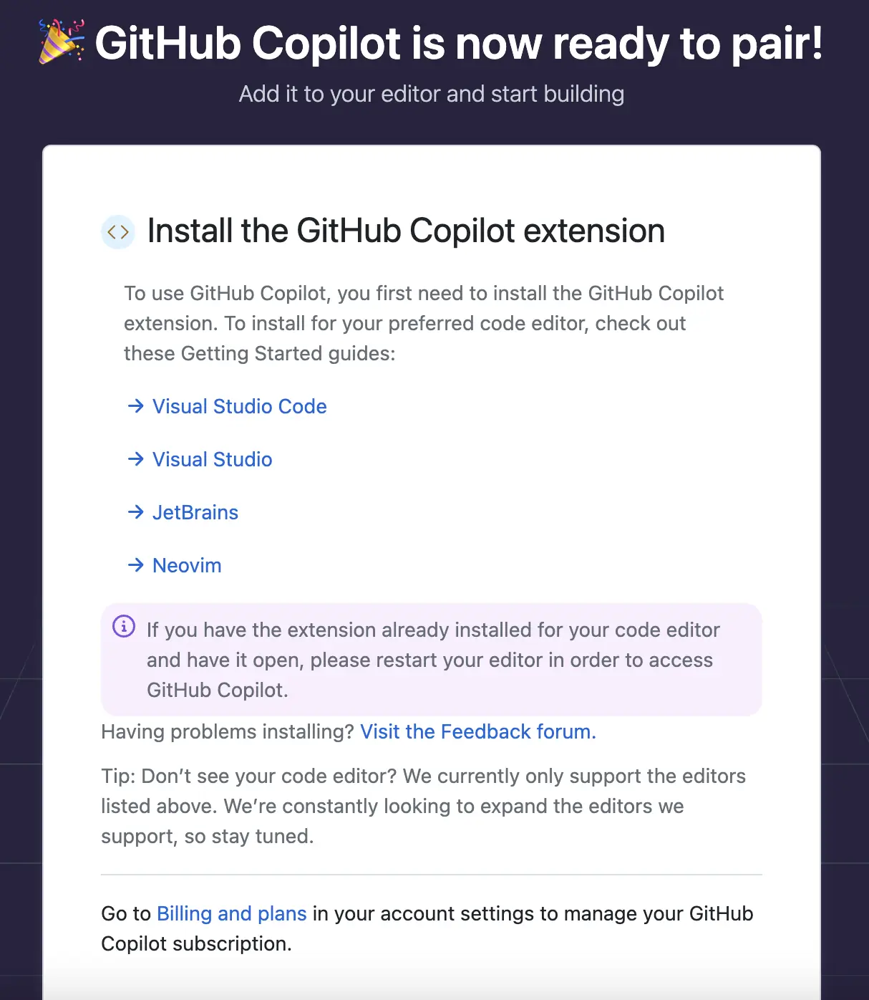
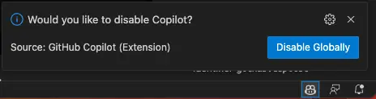
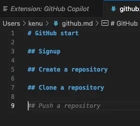

# GitHub Copilot
* AI 기반의 코드 제안 도구
* AI Pair Programmer

## Installation

* Extenstion 메뉴에서 `github copilot` 검색 후 설치
  * 
* 우측 하단의 `Enable Gobally` 클릭
  * 
* 기본 브라우저를 `Chrome`말고 다른 브라우저로 변경(Optional)
  * 
* GitHub.com에 로그인
  * 
* vscode로 돌아와서 `Sign in with GitHub` 클릭
  * 
  * 
* GitHub Copilot은 30일 Free Trial 제공. 30일 뒤부터 결제됨
  * 
* 4대 개발도구에서 사용 가능
  * 
* VS Code에서 우측 하단에 Enable 시키면 사용 가능
  * 
* 정상 동작한다면 제안이 나옴. `Tab`키를 누르면 제안을 받아들임
  * 
* 설치 완료 후에 `기본 브라우저`는 자신이 사용하는 브라우저로 변경(Optional)

## ref
* https://copilot.github.com/
