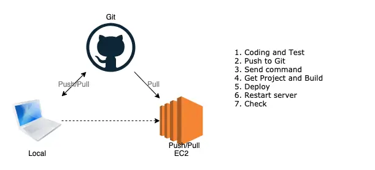

# Deployment 코드 배포
- 지정된 서버에 완성된 프로젝트를 배포하여 프로젝트 애플리케이션을 사용하는 작업
- 빌드 작업이 필요없을 수 있음
- 서버를 재시작할 필요가 있을 수 있음

## Primitive Deployment
- 원시적인 배포는 정적인 파일을 서버에 FTP(SFTP)로 올려서 빌드하고 재시동

## Simple Deployment
- 버전 관리 시스템에 등록된 코드를 받아와서 빌드하는 쉘 스크립트를 실행
- 

## CI Deployment
- CI 도구를 사용해서 배포

## ref
- https://jenkins.io
