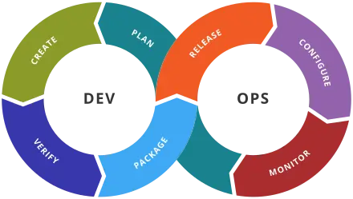
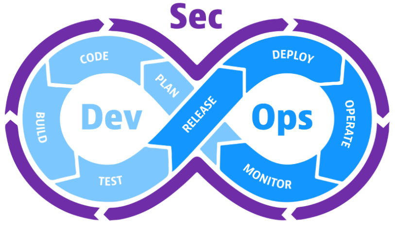

# DevOps
- 소프트웨어의 개발(Development)과 운영(Operations)의 합성어
- 소프트웨어 개발자와 정보기술 전문가 간의 소통, 협업 및 통합을 강조하는 개발 환경이나 문화
- 소프트웨어 개발과 운영을 위한 문화, 방법론, 프로세스, 도구, 문서화, 테스트, 배포, 릴리즈 등을 포함

## 목적
- 제품 출시까지 걸리는 기간(time to market) 단축
- 새로운 판의 더 낮은 실패율
- 픽스 간 짧아진 리드 타임(상품 생산 시작부터 완성까지 걸리는 시간)
- 복구 시 더 빠른 평균 시간 (새로운 릴리스의 충돌 및 그 밖에 현재의 시스템을 비활성화하는 상황에서)

## 툴 체인
- 
- 계획: 목적을 수행하기 앞서 방법이나 절차 등을 미리 생각하여 계획.
- 코드: 코드 개발 및 검토, 버전 관리 도구, 코드 병합
- 빌드: 지속적 통합(CI) 도구, 빌드 상태
- 테스트: 테스트 및 결과가 성능을 결정
- 패키지: 애플리케이션 디플로이 이전 단계
- 릴리스: 변경사항 관리, 릴리스 승인, 릴리스 자동화
- 구성: 인프라스트럭처 구성 및 관리, IaC(Infrastructure as Code) 도구
- 모니터링: 애플리케이션 성능 모니터링, 최종 사용자 경험.

## DevSecOps
- 
- 설계부터 테스트, 배포 및 제품 제공에 이르기까지 소프트웨어 개발 프로세스의 모든 단계에서 보안 구현을 자동화
- 보안 취약점이 발생할 경우 이를 처리
- 따라서 해결하는 것이 더 쉽고 비용도 저렴

## ref
- https://en.wikipedia.org/wiki/DevOps_toolchain
- https://socradar.io/what-are-devops-devsecops-and-rugged-devops/
