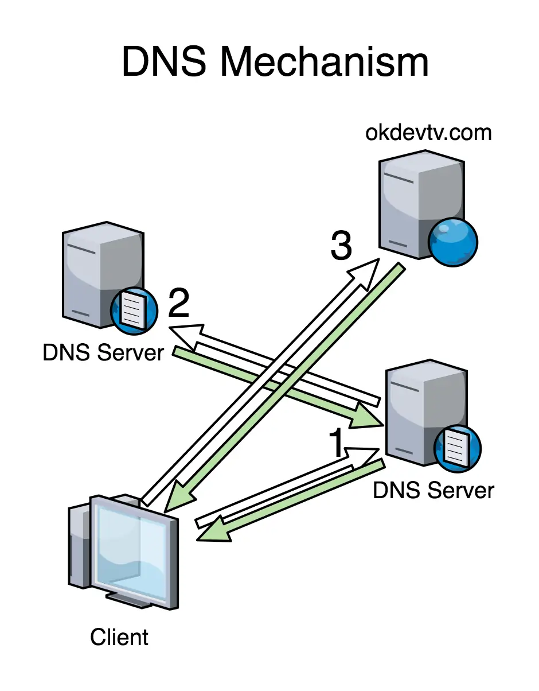

# DNS
- **D**omain **N**ame **S**erver
- matching Domain with IP
- port 53; aws route 53 is a DNS service
- [CloudFlare.com](https://cloudflare.com) is a DNS service

## Mechanism
- 
  - 1. Client가 `www.google.com`을 입력
  - 2. Client의 PC는 DNS 서버에 `www.google.com`에 대한 IP를 요청
  - 3. DNS 서버는 `www.google.com`에 대한 IP를 알려줌
  - 4. Client의 PC는 `www.google.com`에 대한 IP를 받아서 해당 IP로 접속
