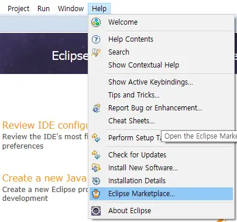
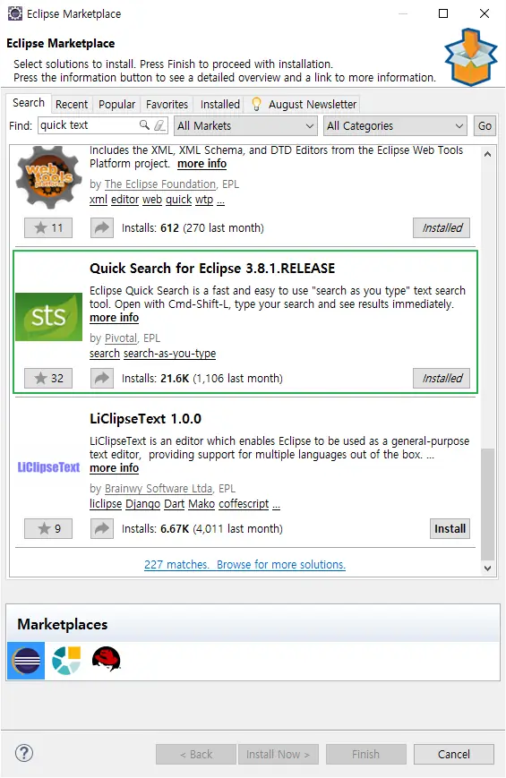
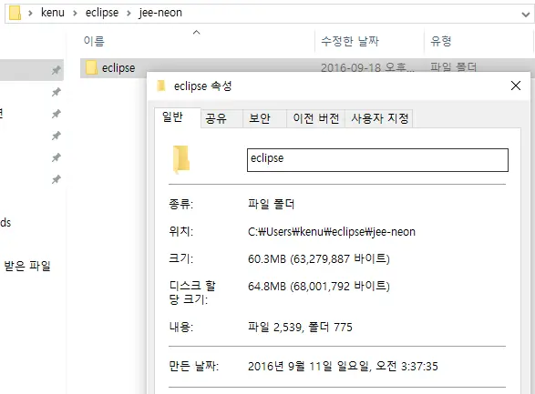
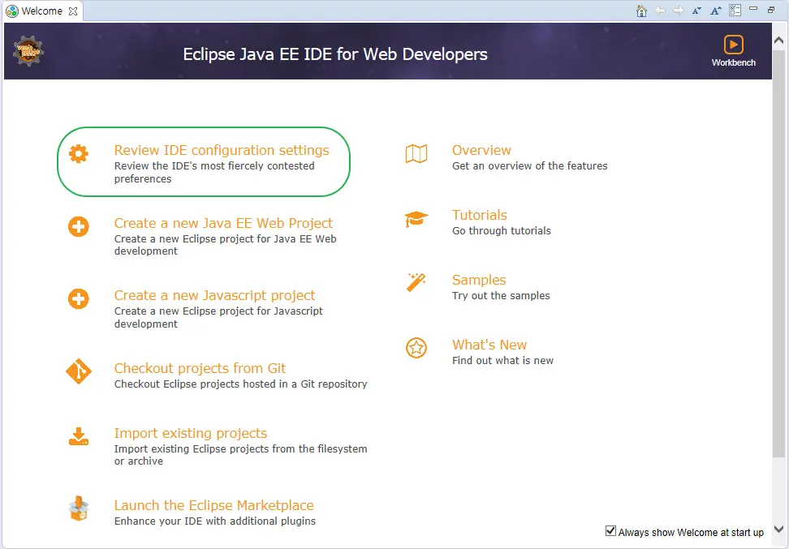
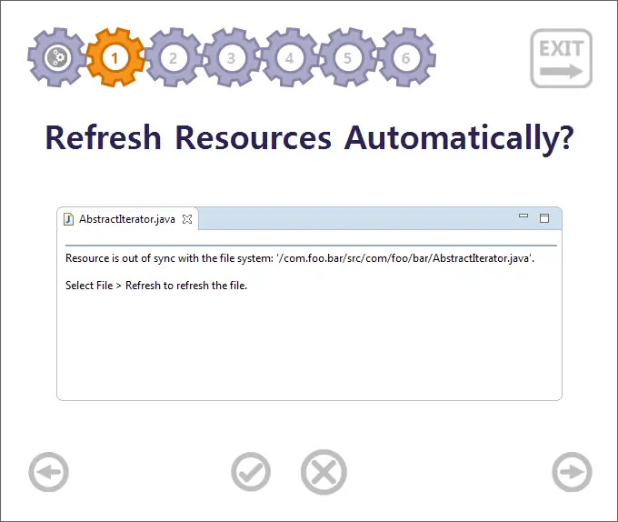

# eclipse
* http://www.eclipse.org

## M1 eclipse error

```sh
sudo codesign --force --deep --sign - /Applications/Eclipse.app
#
rm -rf ~/workspace-eclipse/.metadata/.plugins/
```
- https://stackoverflow.com/a/71740449/510222

## Marketplace
* 
* 
* 
* 
* 
* 

* quick text search

## ref
* http://bit.ly/okeclipse
