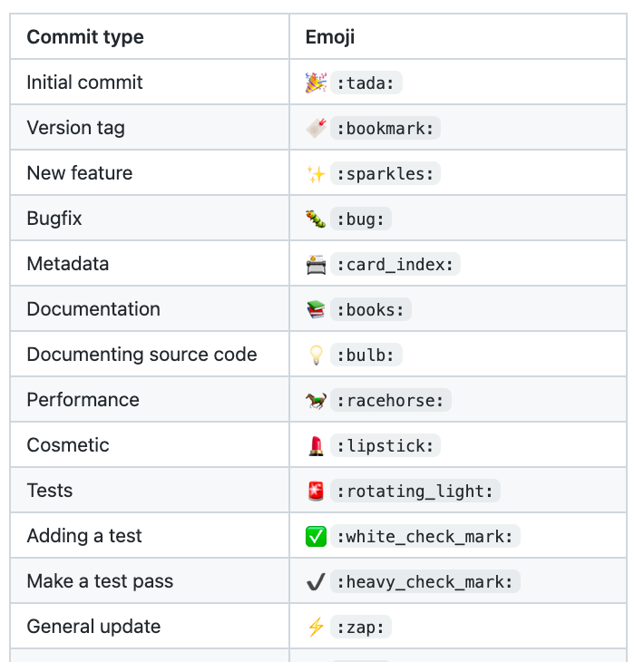

# GitHub
* Repository service using git
* https://github.com
* Fork
* Pull Request
* Private repo possible
* CI: Actions

## GitHub commit emoji

* from: https://gist.github.com/parmentf/035de27d6ed1dce0b36a
* related: https://gitmoji.dev

## related
* [GitHub Actions](/mib/github/actions)
