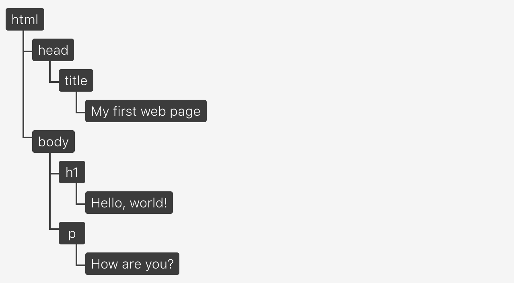

# DOM
* Document Object Model
* 웹 페이지에 대한 인터페이스
* 여러 프로그램들이 페이지의 콘텐츠 및 구조, 그리고 스타일을 읽고 조작할 수 있도록 API를 제공
* 항상 유효한 HTML 형식
* 자바스크립트로 수정할 수 있는 동적 모델
* 가상 요소를 포함하지 않음 (Ex. ::after)
* 보이지 않는 요소를 포함 (Ex. display: none)

## ref
* (번역) DOM은 정확히 무엇일까?
  * https://wit.nts-corp.com/2019/02/14/5522
* https://developer.mozilla.org/ko/docs/Glossary/DOM
* NAVER D2 – 브라우저는 어떻게 동작하는가?
  * https://d2.naver.com/helloworld/59361
