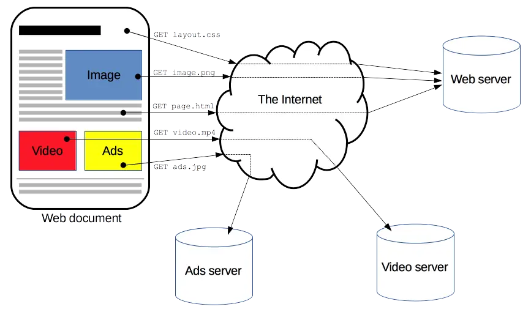
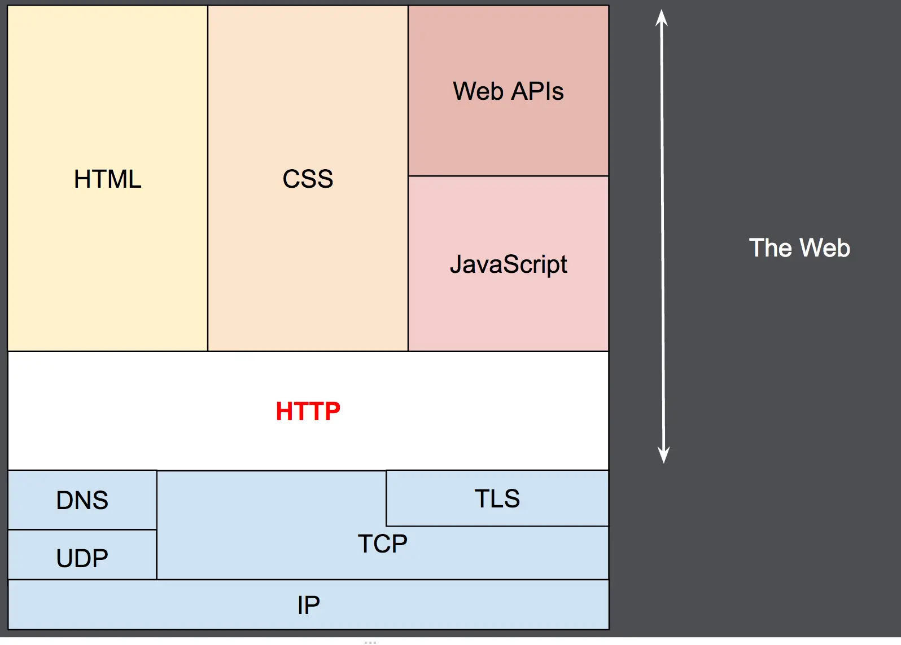

# HTTP
* HyperText Transfer Protocol
* HTTP는 HTML 문서와 같은 리소스들을 가져올 수 있도록 해주는 프로토콜
* 기본포트:  80

### 웹 계층

## HTTPS
* HTTP Secure
* 기본포트: 443
* 웹서버에 인증서 설치 필요

## ref
* https://developer.mozilla.org/ko/docs/Web/HTTP/Overview
