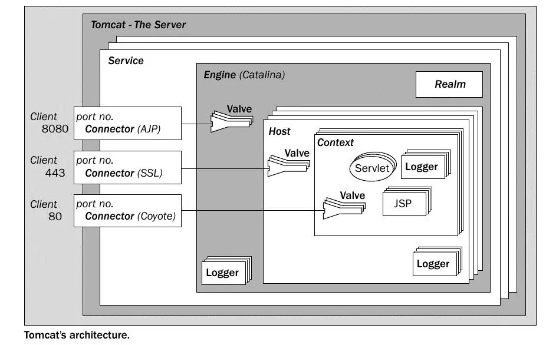

# Tomcat
- https://tomcat.apache.org
- 서블릿 컨테이너 표준 구현 서버
- JAVA_HOME 환경 변수 필요

## Run
```
bin/startup.sh
bin\startup.bat
```

## Folder
- conf
  - server.xml
- webapps
  - ROOT.war
- Maven folder structure vs. WebContent

## Tomcat Architecture


## Eclipse(STS) Tomcat Tip
- Server Options
  - Check `Serve modules without publishing`
  - `application.getRealPath("/")`
- External Web Browser
- Disable all validations

## SSL
- http://tomcat.apache.org/tomcat-9.0-doc/ssl-howto.html
```bash
keytool -genkey -alias tomcat -keyalg RSA -keystore ~/.ssh/okdevtv.keystore
```

- conf/server.xml
```xml
<Connector
           protocol="org.apache.coyote.http11.Http11NioProtocol"
           port="8443" maxThreads="200"
           scheme="https" secure="true" SSLEnabled="true"
           keystoreFile="${user.home}/.ssh/okdevtv.keystore" keystorePass="okpassokpass"
           clientAuth="false" sslProtocol="TLS"/>
```

- check
```
curl https://localhost:8443 -k
```

## Sharing Session
conf/context.xml
```xml
<Context sessionCookiePath="/">
```

- clear cookie and test
- `checker.jsp` in each webapp
```jsp
<%@ page language="java" contentType="text/html; charset=utf-8" pageEncoding="utf-8"%>
<!DOCTYPE html>
<html lang="ko">
<head>
  <meta charset="UTF-8">
  <meta name="viewport" content="width=device-width, initial-scale=1.0">
  <title>Checker</title>
</head>
<body>
  <b>context path</b> : <%= application.getContextPath() %><hr />
  <b>sesseion id</b> : <%= session.getId() %><hr />
  <b>cookie string</b> : <%= request.getHeader("cookie") %>
</body>
</html>
```

## ref
- http://kenu.github.io/tomcat70/docs/
