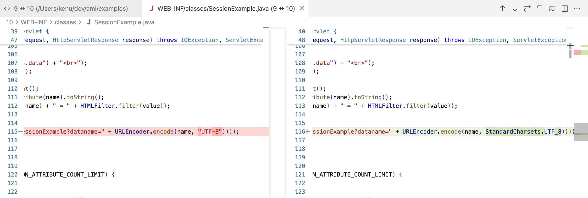

# javax2jakarta

- https://github.com/apache/tomcat-jakartaee-migration
- Java EE 8 기반의 웹 애플리케이션을 Jakarta EE 9로 자동 변환해주는 도구
- Command Line 또는 Ant 태스크로 사용할 수 있으며, 패키지 이름 변경부터 XML 설정 파일까지 자동으로 변환

## Tomcat 9 과 10 의 차이
- diff list

- web.xml

- UTF-8

- web.xml

## ref
- https://ko.wikipedia.org/wiki/자카르타_EE의_버전_역사
- https://ko.wikipedia.org/wiki/자카르타_EE
