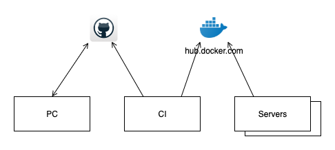

# Jenkins + Docker + AWS EC2
* Create EC2 instance 4G RAM
* Install Jenkins with openjdk, docker, git
* Create private and public keys between servers
* Create two EC2 instances 1G RAM
* Install docker and run daemon for each
* Register app1, app2 in jenkins global setting
* Install `Publish over SSH` plugin
* Create jenkins item
* Run
* Update code and deploy

