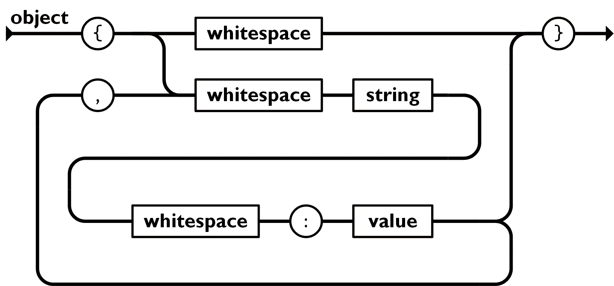

# JS Object
* name/value 형태의 쌍으로 collection 타입.
* 다양한 언어들에서, 이는 object, record, struct(구조체), dictionary, hash table, 키가 있는 list, 또는 연상배열로서 구현되었다.
* object는 name/value 쌍들의 비순서화된 SET이다. object는 `{`좌 중괄호로 시작하고 `}`우 중괄호로 끝내어 표현한다. 각 name 뒤에 `:`colon을 붙이고 `,`comma로 name/value 쌍들 간을 구분한다.
* 
