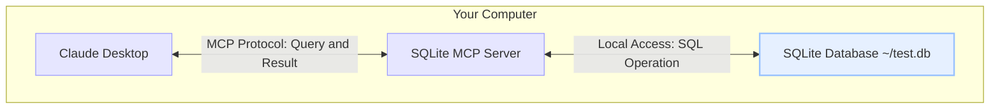

# MCP

## 개요

- Model Context Protocol(MCP)
- AI 모델과 외부 도구, 데이터 소스 간의 통신을 표준화하는 프로토콜
- 2023년 Anthropic에서 처음 제안
- AI 시스템이 외부 세계와 효과적으로 상호작용할 수 있도록 설계

## 주요 특징

- **표준화된 통신**: AI 모델과 외부 서비스 간의 통신 방식을 표준화
- **도구 확장성**: 새로운 도구와 기능을 쉽게 AI 시스템에 통합 가능
- **컨텍스트 관리**: 대화 컨텍스트를 효율적으로 관리하여 AI의 이해도 향상
- **멀티모달 지원**: 텍스트뿐만 아니라 이미지, 오디오 등 다양한 형태의 데이터 처리 지원

## 작동 방식

MCP 주요 구성 요소:

1. **MCP 서버**: 외부 도구와 서비스를 호스팅하고 관리하는 서버
2. **MCP 클라이언트**: AI 모델이 MCP 서버와 통신하기 위한 인터페이스
3. **도구 정의**: 각 도구의 기능, 파라미터, 반환 값 등을 정의하는 스키마

```
AI 모델 <-> MCP 클라이언트 <-> MCP 서버 <-> 외부 도구/서비스
```

## 사용 사례

- **웹 브라우징**: AI가 실시간으로 웹 페이지를 검색하고 정보를 추출
- **데이터 분석**: 외부 데이터베이스나 API에서 데이터를 가져와 분석
- **코드 실행**: 사용자가 제공한 코드를 안전한 환경에서 실행하고 결과 반환
- **IoT 제어**: 스마트홈 기기 등 IoT 장치와 상호작용

## 구현 예시

### 기본 MCP 서버 구현 (Node.js)

```javascript
const express = require('express');
const app = express();
app.use(express.json());

// 도구 정의
const tools = {
  calculator: {
    add: (a, b) => a + b,
    subtract: (a, b) => a - b,
    multiply: (a, b) => a * b,
    divide: (a, b) => a / b
  },
  weather: {
    getTemperature: (city) => {
      // 실제 구현에서는 날씨 API 호출
      return `${city}의 현재 온도는 22°C입니다.`;
    }
  }
};

// MCP 엔드포인트
app.post('/mcp', (req, res) => {
  const { tool, method, params } = req.body;
  
  if (!tools[tool] || !tools[tool][method]) {
    return res.status(400).json({ error: '유효하지 않은 도구 또는 메서드' });
  }
  
  try {
    const result = tools[tool][method](...params);
    res.json({ result });
  } catch (error) {
    res.status(500).json({ error: error.message });
  }
});

app.listen(3000, () => {
  console.log('MCP 서버가 포트 3000에서 실행 중입니다.');
});
```

### Python에서의 MCP 클라이언트 예시

```python
import requests
import json

class MCPClient:
    def __init__(self, server_url):
        self.server_url = server_url
        
    def call_tool(self, tool, method, params):
        payload = {
            "tool": tool,
            "method": method,
            "params": params
        }
        
        response = requests.post(
            f"{self.server_url}/mcp", 
            json=payload
        )
        
        if response.status_code == 200:
            return response.json()["result"]
        else:
            error = response.json().get("error", "알 수 없는 오류")
            raise Exception(f"MCP 호출 실패: {error}")

# 사용 예시
client = MCPClient("http://localhost:3000")
result = client.call_tool("calculator", "add", [5, 3])
print(f"5 + 3 = {result}")  # 출력: 5 + 3 = 8

weather = client.call_tool("weather", "getTemperature", ["서울"])
print(weather)  # 출력: 서울의 현재 온도는 22°C입니다.
```

## MCP 다이어그램 예시



## 주요 특징

- **표준화된 통신**: AI 모델과 외부 서비스 간의 통신 방식을 표준화
- **도구 확장성**: 새로운 도구와 기능을 쉽게 AI 시스템에 통합 가능
- **컨텍스트 관리**: 대화 컨텍스트를 효율적으로 관리하여 AI의 이해도 향상
- **멀티모달 지원**: 텍스트뿐만 아니라 이미지, 오디오 등 다양한 형태의 데이터 처리 지원

## MCP와 Claude, GPT 통합

최신 AI 모델들은 MCP를 통해 외부 도구와 통합:

- **Claude (Anthropic)**: Claude는 MCP를 기본적으로 지원하며, Claude API를 통해 MCP 서버와 연결
- **GPT (OpenAI)**: OpenAI의 GPT 모델은 Function Calling 기능을 통해 MCP와 유사한 기능 제공

## 보안 고려사항

MCP를 구현할 때 고려해야 할 주요 보안 사항:

- **인증 및 권한 부여**: MCP 서버에 대한 접근 제어
- **입력 검증**: 모든 사용자 입력 및 AI 요청에 대한 철저한 검증
- **샌드박싱**: 코드 실행 등의 위험한 작업은 격리된 환경에서 수행
- **속도 제한**: 과도한 API 호출 방지를 위한 속도 제한 구현

## MCP 서버 목록

### 브라우저 및 웹 자동화
- **[Puppeteer MCP 서버](https://github.com/puppeteer/puppeteer)**: 웹 브라우저 자동화 및 스크래핑 기능 제공
- **[BrowserStack MCP 서버](https://github.com/browserstack/mcp-server)**: 다양한 브라우저 환경에서 웹 테스트 자동화
- **[mcp-server-rag-web-browser](https://github.com/apify/mcp-server-rag-web-browser)**: RAG(Retrieval-Augmented Generation) 기반 웹 브라우징
- **[Website Generator](https://github.com/b12io/website-generator-mcp-server)**: 웹사이트 생성 자동화

### 데이터 및 분석
- **[Pinecone Developer MCP](https://github.com/pinecone-io/pinecone-mcp)**: 벡터 데이터베이스 연동
- **[mcp-hydrolix](https://github.com/hydrolix/mcp-hydrolix)**: 대규모 데이터 분석
- **[mcp-server-qdrant](https://github.com/qdrant/mcp-server-qdrant)**: 벡터 검색 엔진 연동
- **[Nodit MCP Server](https://github.com/noditlabs/nodit-mcp-server)**: 블록체인 데이터 분석

### 클라우드 및 개발 도구
- **[Heroku MCP server](https://github.com/heroku/heroku-mcp-server)**: Heroku 플랫폼 접근 및 관리
- **[AlibabaCloud MCP Server](https://github.com/aliyun/alibabacloud-core-mcp-server)**: 알리바바 클라우드 서비스 연동
- **[steampipe-mcp](https://github.com/turbot/steampipe-mcp)**: 클라우드 인프라 쿼리 및 관리
- **[APISIX-MCP](https://github.com/api7/apisix-mcp)**: API 게이트웨이 관리

### 검색 및 정보 검색
- **[Kagi MCP Server](https://github.com/kagisearch/kagimcp)**: 프라이버시 중심 웹 검색
- **[BigGo MCP Server](https://github.com/Funmula-Corp/BigGo-MCP-Server)**: 상품 검색 및 비교
- **[ScrapeGraph MCP Server](https://github.com/ScrapeGraphAI/scrapegraph-mcp)**: 웹 스크래핑 및 데이터 추출

### 언어 및 번역
- **[Lara Translate MCP Server](https://github.com/translated/lara-mcp)**: 기계 번역 서비스
- **[Opik MCP Server](https://github.com/comet-ml/opik-mcp)**: 자연어 처리 및 분석

### 자동화 및 통합
- **[Make MCP Server](https://github.com/integromat/make-mcp-server)**: 워크플로우 자동화
- **[YingDao RPA MCP Server](https://github.com/ying-dao/yingdao_mcp_server)**: 로봇 프로세스 자동화
- **[UseGrant MCP Server](https://github.com/usegranthq/mcp-server)**: 권한 관리 자동화

### 보안 및 인프라
- **[Infisical MCP Server](https://github.com/Infisical/infisical-mcp-server)**: 시크릿 및 환경 변수 관리
- **[Binalyze AIR MCP Server](https://github.com/binalyze/air-mcp)**: 디지털 포렌식 및 보안

### 게임 및 그래픽
- **[PlayCanvas Editor MCP Server](https://github.com/playcanvas/editor-mcp-server)**: 3D 웹 게임 개발
- **[Needle MCP Server](https://github.com/needle-ai/needle-mcp)**: 3D 콘텐츠 생성
- **[Magic UI MCP Server](https://github.com/magicuidesign/mcp)**: UI 디자인 자동화

### 금융 및 결제
- **[Square MCP Server](https://github.com/square/square-mcp-server)**: 결제 처리 및 고객 관리
- **[Paddle MCP Server](https://github.com/PaddleHQ/paddle-mcp-server)**: 구독 및 결제 관리

### 기타 특수 서버
- **[Satstream MCP Server](https://github.com/satstream/ss-mcp)**: 위성 데이터 처리
- **[gotoHuman MCP](https://github.com/gotohuman/gotohuman-mcp-server)**: 인간 전문가 연결
- **[Sensei MCP](https://github.com/dojoengine/sensei-mcp)**: 게임 개발 및 블록체인 통합
- **[mcp-metricool](https://github.com/metricool/mcp-metricool)**: 소셜 미디어 마케팅 분석
- **[Atla](https://github.com/atla-ai/atla-mcp-server)**: AI 모델 관리 및 배포

## 참고 자료

- [Anthropic MCP 공식 문서](https://www.anthropic.com/news/claude-3-model-context-protocol)
- [Claude MCP 공식 문서](https://www.claudemcp.com/docs/quickstart)
- [MCP GitHub 레포지토리](https://github.com/anthropics/anthropic-cookbook/tree/main/mcp)
- [Anthropic 개발자 커뮤니티](https://discord.com/invite/zkrBaqytPW)
- [Glama.ai MCP 서버 목록](https://glama.ai/mcp/servers)
- [Awesome MCP Servers](https://github.com/punkpeye/awesome-mcp-servers)
