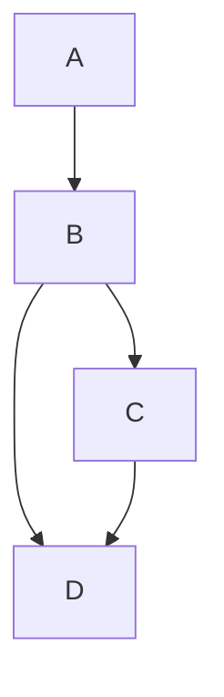
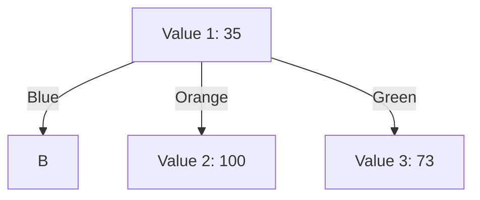

# mermaid
- Text to Graph

```mermaid
graph TD;
    A-->B;
    B-->C;
    B-->D;
    C-->D;
```

```mermaid
%%{init: {"theme": "default"}}%%
graph TD
    A[Value 1: 35] -->|Blue| B
    A -->|Orange| C[Value 2: 100]
    A -->|Green| D[Value 3: 73]
```
