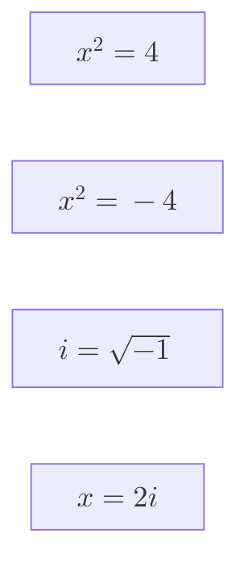

# mermaid js
- https://mermaid.js.org/
- mermaid is a javascript based diagramming and charting tool.

## Math

```mermaid
graph LR
  A["$$x^2 = 4$$"]
  B["$$x^2 = -4$$"]
  C["$$i = \sqrt{-1}$$"]
  D["$$x = 2i$$"]
```

