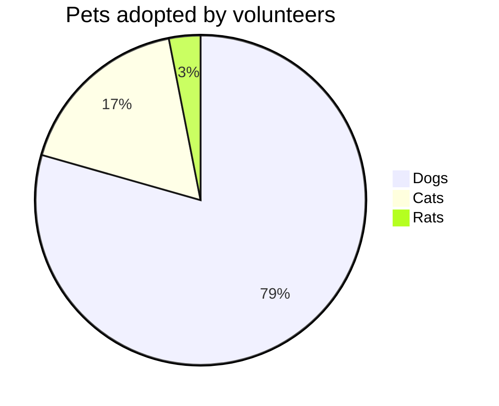
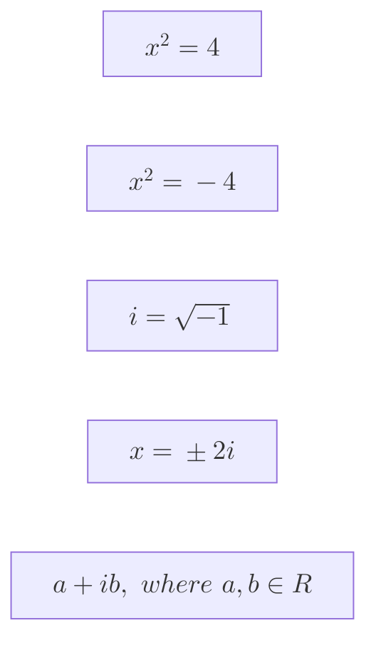
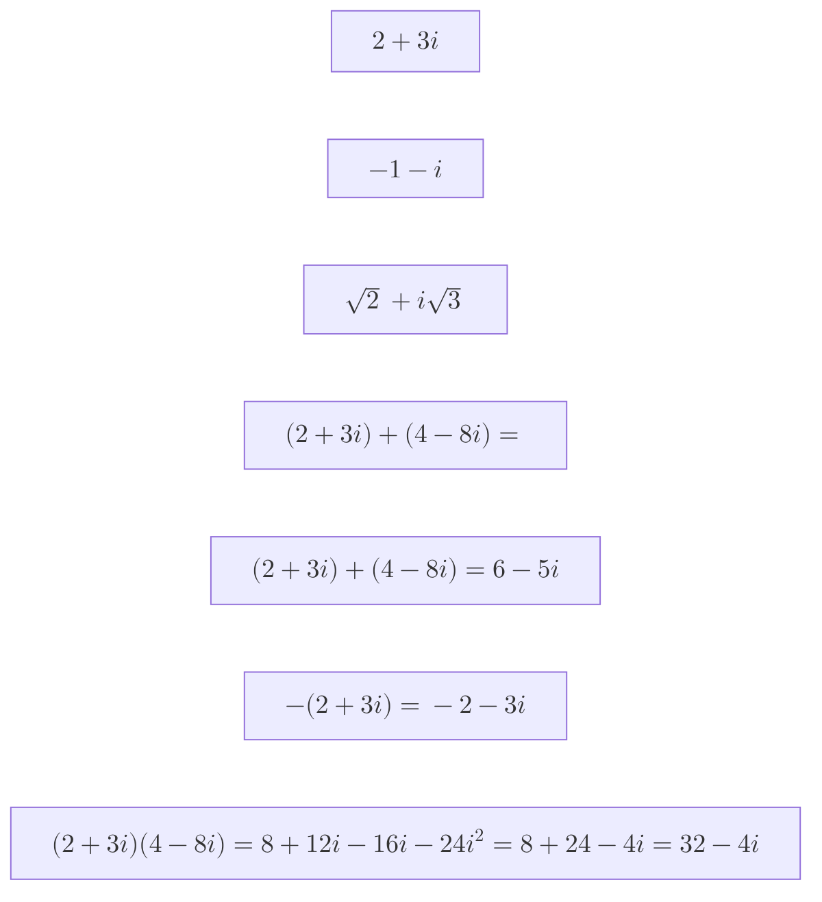
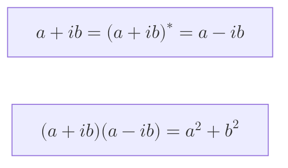
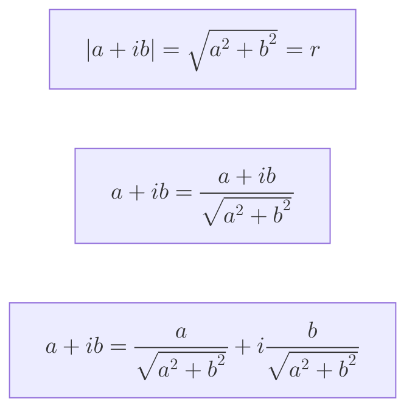
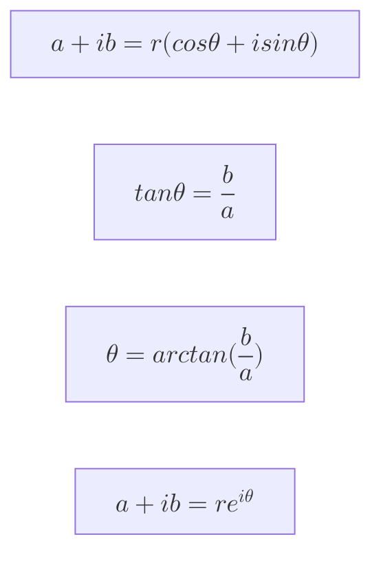

# mermaid js
- https://mermaid.js.org/
- mermaid is a javascript based diagramming and charting tool.
## Pie Chart

- example: [/md/mermaid/m.html](/md/mermaid/m.html)

## Math

### Complex Numbers

### Complex Conjugate

### Complex Numbers on the plane

- polar form
$$a+ib = r(cos\theta+i sin\theta)$$
- exponential form
$$a+ib=re^{i\theta}$$

$$1+i
=\sqrt{2}(cos(\frac{\pi}{4})+i sin(\frac{\pi}{4}))
=\sqrt{2}e^{i\frac{\pi}{4}}$$

$$2\sqrt{2}e^{i\frac{\pi}{4}}$$
$$2\sqrt{2}e^{i\frac{-\pi}{2}}$$
$$2\sqrt{2}e^{i\frac{3\pi}{4}}$$

$$e^{i\frac{\pi}{5}}e^{i\frac{\pi}{3}} = e^{i\frac{8\pi}{15}}$$

### Matricies

$$\begin{bmatrix}1\space -2\\0\space -10\end{bmatrix}$$
$$\begin{bmatrix}1\\2\\-3\\8\end{bmatrix}$$
$$\begin{bmatrix}5\space-2\space3\\7\space2\space1.5\end{bmatrix}$$

#### m x n matrix

$$\begin{bmatrix}1\space -2\space 3\\0\space -10\space 4\\1\space 2\space 3\end{bmatrix}$$

---

$$\begin{pmatrix} 1 & 1 & 2 \\ -1 & 2 & 1 \ \end{pmatrix}$$

$$\text{det} = 1(-1) - (-1)(2) = -1 + 2 = 1$$
