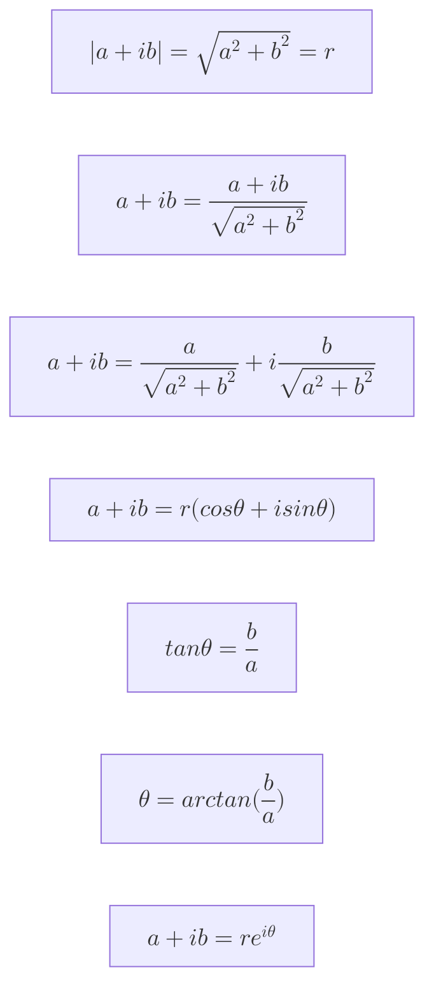

# mermaid js
- https://mermaid.js.org/
- mermaid is a javascript based diagramming and charting tool.
## Pie Chart

- example: [/md/mermaid/m.html](/md/mermaid/m.html)

## Math

### Complex Numbers

### Complex Conjugate

### Complex Numbers on the plane

