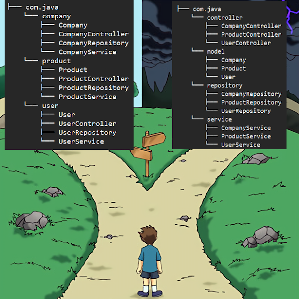

# Modular Monolith

## Modular Monolith란?
모듈러 모놀리스(Modular Monolith)는 모놀리식 아키텍처의 단점을 보완하면서도 마이크로서비스의 복잡성을 피하기 위한 중간 지점의 아키텍처 접근 방식임. 이는 단일 애플리케이션 내에서 명확하게 정의된 경계와 인터페이스를 가진 독립적인 모듈로 구성됨.


## 모놀리스와 마이크로서비스의 중간 지점
모듈러 모놀리스는 다음과 같은 특징을 가짐:

- **단일 배포 단위**: 전체 애플리케이션이 하나의 단위로 배포됨
- **모듈화된 코드베이스**: 내부적으로 잘 정의된 모듈 경계를 가짐
- **명확한 의존성 관리**: 모듈 간 의존성이 명시적으로 관리됨
- **공유 인프라**: 데이터베이스, 캐시 등의 인프라를 공유할 수 있음

## 모듈러 모놀리스의 장점

### 1. 개발 복잡성 감소
- 마이크로서비스에 비해 초기 개발 복잡성이 낮음
- 분산 시스템의 복잡성(네트워크 지연, 데이터 일관성 등)을 피할 수 있음
- 단일 코드베이스로 개발 환경 설정이 간단함

### 2. 유연한 확장 경로
- 필요에 따라 특정 모듈을 마이크로서비스로 분리할 수 있는 진화 경로 제공
- 비즈니스 요구사항 변화에 따라 점진적으로 아키텍처 발전 가능

### 3. 모듈 독립성과 응집력
- 각 모듈은 특정 비즈니스 도메인이나 기능에 집중
- 모듈 내부 구현은 캡슐화되어 다른 모듈에 영향을 최소화함
- 도메인 주도 설계(DDD)의 원칙을 적용하기 용이함

### 4. 운영 단순성
- 단일 애플리케이션으로 배포 및 모니터링이 간단함
- 인프라 요구사항이 마이크로서비스보다 단순함
- 트랜잭션 관리가 더 쉬움

## 모듈러 모놀리스의 단점

### 1. 기술 스택 제약
- 모든 모듈이 동일한 기술 스택을 사용해야 함
- 특정 모듈에 최적화된 기술을 선택하기 어려움

### 2. 확장성 제한
- 애플리케이션 전체가 함께 확장되므로 리소스 활용이 비효율적일 수 있음
- 특정 모듈만 독립적으로 확장하기 어려움

### 3. 배포 위험
- 전체 애플리케이션을 한 번에 배포해야 하므로 위험이 더 큼
- 작은 변경사항도 전체 시스템 재배포 필요

## 모듈러 모놀리스 설계 원칙

### 1. 명확한 모듈 경계 정의
- 각 모듈은 명확한 책임과 경계를 가져야 함
- 모듈 간 인터페이스는 명시적이고 최소화되어야 함

### 2. 의존성 관리
- 모듈 간 의존성은 단방향이어야 함
- 순환 의존성을 피하고 의존성 방향을 명확히 함

### 3. 공유 코드 최소화
- 모듈 간 공유 코드를 최소화하여 결합도를 낮춤
- 필요한 경우 공유 라이브러리를 통해 코드 중복 방지

### 4. 내부 API 설계
- 모듈 간 통신을 위한 내부 API를 명확히 정의
- 모듈 내부 구현 세부사항을 노출하지 않음

## 모듈러 모놀리스 구현 전략

### 1. 패키지 구조화
```
com.example.application/
  ├── module1/
  │   ├── api/         # 모듈의 공개 인터페이스
  │   ├── internal/    # 모듈 내부 구현
  │   └── domain/      # 모듈의 도메인 모델
  ├── module2/
  │   ├── api/
  │   ├── internal/
  │   └── domain/
  └── shared/          # 공유 코드 (최소화)
```


### 2. 모듈 간 통신 패턴
- **직접 API 호출**: 모듈 API를 통한 직접 호출
- **이벤트 기반 통신**: 모듈 간 느슨한 결합을 위한 이벤트 발행/구독
- **중재자 패턴**: 모듈 간 직접 의존성을 줄이기 위한 중재자 사용

### 3. 데이터베이스 전략
- **스키마 분리**: 각 모듈이 자체 데이터베이스 스키마를 사용
- **공유 데이터베이스 접근 제한**: 모듈은 자신의 테이블만 직접 접근
- **데이터 접근 계층 캡슐화**: 각 모듈은 자체 데이터 접근 계층을 가짐


## 마이크로서비스로의 진화

모듈러 모놀리스는 마이크로서비스로 진화하기 위한 중간 단계로 활용될 수 있음:

1. **모듈 식별 및 경계 설정**: 비즈니스 도메인에 따라 모듈 분리
2. **모듈 간 의존성 최소화**: 모듈 간 결합도를 낮춤
3. **내부 API 설계**: 마이크로서비스 API로 발전할 수 있는 내부 API 설계
4. **점진적 분리**: 필요에 따라 특정 모듈을 마이크로서비스로 분리


## 모듈러 모놀리스 적용 사례

### 1. 중소규모 애플리케이션
- 마이크로서비스의 복잡성을 감당하기 어려운 중소규모 팀
- 빠른 개발 속도와 간단한 운영이 중요한 프로젝트

### 2. 스타트업
- 빠른 제품 개발과 검증이 필요한 스타트업
- 미래 확장을 고려하면서도 초기 복잡성을 관리해야 하는 경우

### 3. 레거시 모놀리스 현대화
- 기존 모놀리스를 점진적으로 개선하는 중간 단계
- 마이크로서비스로 완전히 전환하기 전 코드베이스 정리

## 결론

모듈러 모놀리스는 모놀리식 아키텍처의 단순성과 마이크로서비스의 모듈성을 결합한 실용적인 접근 방식임. 이는 많은 조직에게 적절한 절충안을 제공하며, 필요에 따라 마이크로서비스로 진화할 수 있는 경로를 제공함.

아키텍처 선택은 비즈니스 요구사항, 팀 규모, 기술적 성숙도 등 여러 요소를 고려하여 결정해야 함. 모듈러 모놀리스는 많은 상황에서 "적당히 좋은" 솔루션으로, 불필요한 복잡성을 피하면서도 확장 가능한 시스템을 구축할 수 있게 함.

## 참고 자료
- [Modular Monoliths - Simon Brown](https://www.youtube.com/watch?v=5OjqD-ow8GE)
- [Modular Monolith: A Primer - Kamil Grzybek](https://www.kamilgrzybek.com/design/modular-monolith-primer/)
- [Shopify's Journey to Modular Monolith](https://engineering.shopify.com/blogs/engineering/deconstructing-monolith-designing-software-maximizes-developer-productivity)
- [The Majestic Monolith - David Heinemeier Hansson](https://m.signalvnoise.com/the-majestic-monolith/)
- [MonolithFirst - Martin Fowler](https://martinfowler.com/bliki/MonolithFirst.html)
- [모놀리스에서 마이크로서비스 아키텍처로의 전환 전략::박선용::AWS Summit Seoul 2018](https://www.slideshare.net/slideshow/architecture-conversion-strategy-from-monolith-to-microservice-seon-yong-park/94105825)