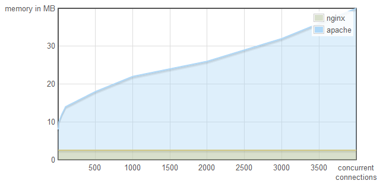

# nginx
* http://nginx.org/
* 아파치 httpd 서버의 뚱뚱함 때문에 만들어진 경량 웹서버
* 이벤트 루프를 이용해 성능 탁월함
  * 
  * from: https://blog.webfaction.com/2008/12/a-little-holiday-present-10000-reqssec-with-nginx-2/
* 설정이 간편함
* [영상: Nginx 정말 가벼운 웹서버](https://youtu.be/u-leHy-l2a8)

## nginx 설치
* aws EC2 기준

```
# centos 7
sudo amazon-linux-extras install nginx1
sudo systemctl start nginx
```

* 기본 설정

```
curl -i http://localhost
sudo chmod 644 /var/log/nginx
sudo chown -R ec2-user:ec2-user /usr/share/nginx/html
echo "<h1>Hello World</h1>" > /usr/share/nginx/html/hello.html
```

* http://아이피/
* http://아이피/hello.html

## 자동 시작
```
# centos 7
systemctl enable nginx.service
```

## 설정
* `cd /etc/nginx/ && vim nginx.conf` 기본 설정 파일
* conf.d/ 폴더에 도메인별로 설정 파일 분리 가능

### Reverse Proxy
* "서버단에 다수의 웹서버를 두고, 매번 요청이 발생할 때마다 어떤 서버에게 이 요청을 처리하도록 지시할지 결정하는 역할을 수행한다."
  * from: [IT 방랑기] https://jcdgods.tistory.com/322

```
    location / {
        sendfile off;
        proxy_pass         http://127.0.0.1:3000;
        proxy_redirect     default;
        proxy_http_version 1.1;
        proxy_set_header   Host              $host;
        proxy_set_header   X-Real-IP         $remote_addr;
        proxy_set_header   X-Forwarded-For   $proxy_add_x_forwarded_for;
        proxy_set_header   X-Forwarded-Proto $scheme;
        proxy_cache_bypass $http_upgrade;
        proxy_max_temp_file_size 0;
    }
```

### client ip forward to WAS
```
        proxy_set_header    X-Real-Ip        $remote_addr;
        proxy_set_header    X-Fowarded-For   $remote_addr;
```

### gzip
```
http {
...
    keepalive_timeout  65;

    gzip  on;
    gzip_types text/plain text/css application/json application/javascript application/x-javascript text/xml application/xml application/xml+rss text/javascript;
...
}
```

### max file upload

```
client_max_body_size 200M;
```

### http to https

```
server {
    # ...
    if ($http_x_forwarded_proto = 'http') {
        return 307 https://$host$request_uri;
    }
```
* https://aws.amazon.com/ko/premiumsupport/knowledge-center/redirect-http-https-elb/

### http to https without `www.`

```
server {
    server_name  www.okdevtest.net;
    rewrite ^(.*) http://okdevtest.net$1 permanent;
}

server {
    listen 443 ssl http2;
    server_name okdevtest.net;
```

* from: https://stackoverflow.com/a/7958540/510222 , https://rsec.kr/?p=182

## 관련
* nginx detailed https://okdevtv.com/mib/nginx/nginx-detail
* letsencrypt https://okdevtv.com/mib/letsencrypt

## 참고
* https://nginx.org/
* https://dassur.ma/things/h2setup/
