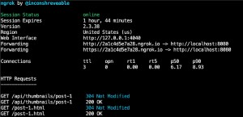

# ngrok
* https://ngrok.com/
* Public URLs for localhost.

## install
* node

```
npm i -g ngrok
```

* download
  * https://ngrok.com/download

## 사용
* 로컬 서버 구동 후 ngrok 실행

```
ngrok http 8080
```
* 
