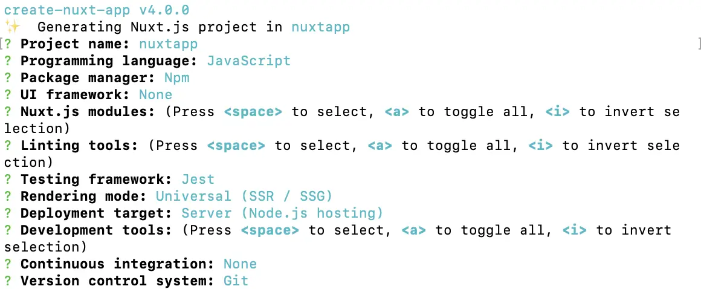

# NuxtJS
- https://nuxtjs.org
- The Intuitive Vue Framework

## Create Nuxt App
```
npm init nuxt-app nuxtapp
```
- Select options
- 

## Folder structure
- `assets` : css, image, font 같은 정적 리소스
- `components`: 애플리케이션에서 사용하는 컴포넌트들을 정의, 비동기 데이터 함수인 `asyncData`, `fetch` 사용 안됨
- `content`: Markdown, JSON, YAML, XML, CSV와 같은 파일을 가져오고 관리. [`nuxt/contents`](https://content.nuxtjs.org/)
- `layouts`: 전체 페이지에 대한 레이아웃. 기본 default.vue
- `middleware`: 페이지 또는 레이아웃이 렌더링 되기 전 실행
- `module`: Nuxt module은 핵심 기능을 확장하고 통합, 추가 가능. [Nuxt Community](https://github.com/nuxt-community/awesome-nuxt)에 모듈 공개
- `pages`: 실제 애플리케이션의 페이지 구성을 포함하며 해당 디렉토리의 구조에 따라 router가 자동으로 생성됨
- `plugins`: 애플리케이션에 바인딩 될 외부 혹은 내부 plugins를 포함, 인스턴스 되기 전 실행, 전역적으로 구성 요소 등록. 함수 또는 상수 삽입 가능
- `static`: html, javascript 파일
- `store`: vuex store 파일, index.js 작성시 store 활성화

## Nuxt Scripts
- `dev`: 개발 서버를 Hot-reloading 상태로 localhost:3000으로 실행
- `build`: Webpack을 통해 애플리케이션을 빌드
- `start`: 프로덕션(nuxt 배포)모드로 서버를 시작(build 실행 후 진행)
- `generate`: 애플리케이션을 빌드하고 모든 라우트를 HTML 파일로 생성(정적 호스팅)

## 개발 실행
```
npm run dev
```

## ref
- https://kdydesign.github.io/2019/04/10/nuxtjs-tutorial/
