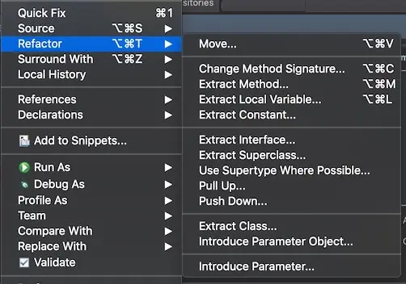

# 리팩토링

- Re + factor + ing = 재구성
- 코드의 재구성 

## 자주 사용하는 리팩토링

### Rename Variable

### Extract Variable

### Extract Constant

### Inline

### Extract Method

## YouTube
- 자주 사용하는 리팩토링 5가지
  * https://youtu.be/z0cxmGfuuWg
