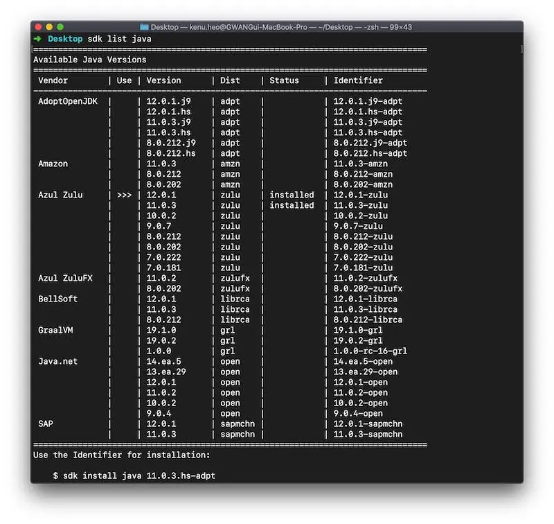

# SDKMAN
- http://sdkman.io/
- `sdk install kotlin`
- `sdk install springboot`
- `sdk help`
- Windows need Cygwin or [Git Bash](https://git-scm.com)
  * zip.exe in Windows folder
  * http://stahlworks.com/dev/index.php?tool=zipunzip
```sh
curl -O http://stahlworks.com/dev/zip.exe
mv zip.exe /c/Windows
```
- open bash shell
```sh
curl -s "https://get.sdkman.io" | bash
```
- restart bash shell


## version
- `sdk install springboot 1.5.6.RELEASE`
- `sdk default springboot 1.5.8.RELEASE`
- `sdk list java`

