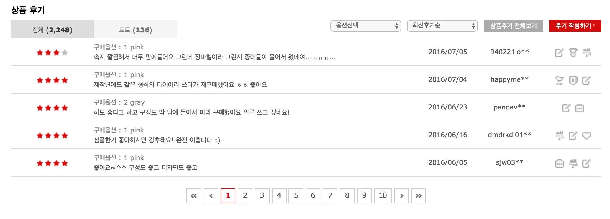
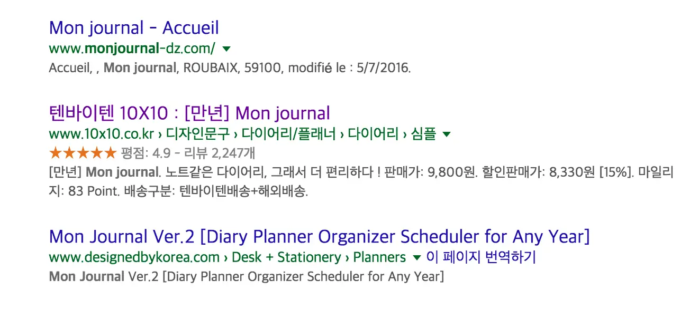
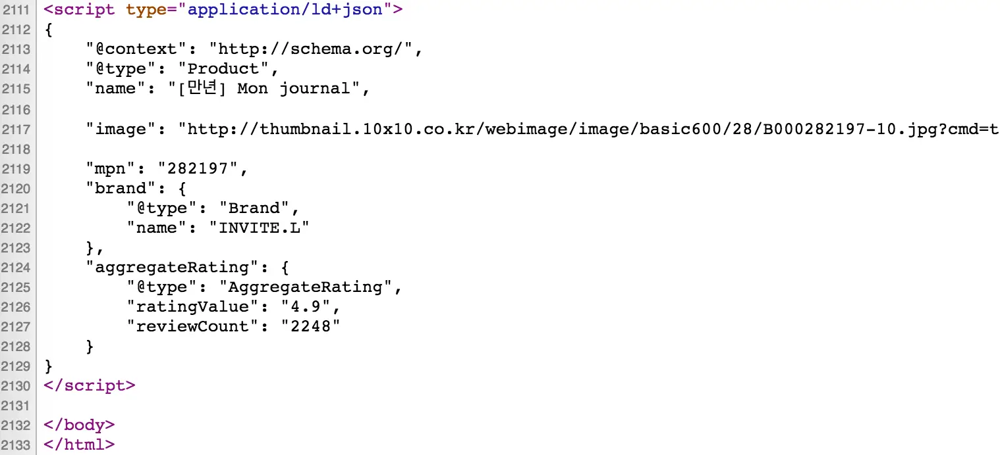

# Search Engine Optimization(SEO)

## 상품평점(별점) 노출
* 상품페이지의 별점을 구글 검색결과에 노출
* 예 http://www.10x10.co.kr/shopping/category_prd.asp?itemid=282197

* 상품에 달린 별점

* 구글 검색 결과에 노출된 상품평점

* 소스 하단에 위치
  * view-source:www.10x10.co.kr/shopping/category_prd.asp?itemid=282197

