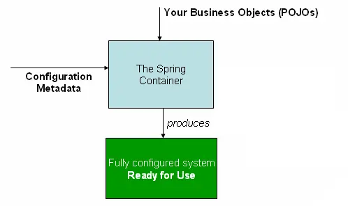

# IoC Container
* Inversion of Control Pattern
* Dependency Injection Pattern
* 전략 패턴(Strategy Pattern): 바꾸기 쉬운 구조
* `org.springframework.beans`, `org.springframework.context` 패키지

## Mechanism

* Config metadata + POJO = executable app

## Bean Factory
* `BeanFactory`
* `ApplicationContext`

```java
public static void main(String[] args) {
  // BeanFactory
  Resource r = new ClassPathResource("applicationContext.xml");
  BeanFactory factory = new XmlBeanFactory(r);

  Employee e1 = (Employee) factory.getBean("e1");
  e1.show();

  // ApplicationContext
  ApplicationContext context = new ClassPathXmlApplicationContext("applicationContext.xml");
  Employee e2 = (Employee) context.getBean("e1");
  e2.show();
}
```

```xml
<?xml version="1.0" encoding="UTF-8"?>
<beans
	xmlns="http://www.springframework.org/schema/beans"
	xmlns:xsi="http://www.w3.org/2001/XMLSchema-instance"
	xmlns:p="http://www.springframework.org/schema/p"
	xsi:schemaLocation="http://www.springframework.org/schema/beans http://www.springframework.org/schema/beans/spring-beans-3.0.xsd">

  <bean id="address1" class="com.javapoint.Address">
    <constructor-arg value="21,Lohianagar"></constructor-arg>
    <constructor-arg value="Ghaziabad"></constructor-arg>
    <constructor-arg value="UP"></constructor-arg>
    <constructor-arg value="USA"></constructor-arg>
  </bean>

  <bean id="e1" class="com.javapoint.Employee">
    <constructor-arg value="101"></constructor-arg>
    <constructor-arg value="Sachin"></constructor-arg>
    <constructor-arg ref="address1"></constructor-arg>
  </bean>

</beans>
```

## ref
* https://www.javatpoint.com/ioc-container
