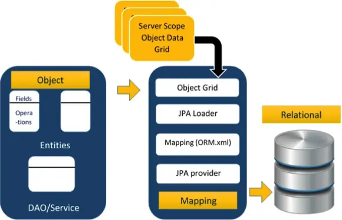
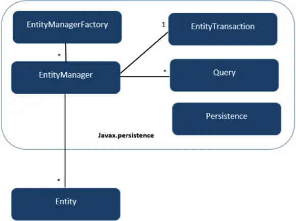

# JPA
- Java Persistence API
- ORM의 자바 표준 규격; Object Relation Mapping
- Bridge between object models(Java) and relational models(database)
- Relational: table 구조, Object: graph 구조
- JSR 220, JSR 317, JSR 338
- JPA Provider
  - Hibernate, Eclipselink, Toplink, Spring Data JPA, etc.



## 관계형과 차이점
  - Granularity: 객체 모델은 관계형 모델보다 세분화됩니다.
  - Subtypes: 하위 유형(상속을 의미)은 모든 유형의 관계형 데이터베이스에서 지원되지 않습니다.
  - Identity: 객체 모델과 마찬가지로 관계형 모델은 동등성을 작성하는 동안 정체성을 노출하지 않습니다.
  - Associations: 관계형 모델은 개체 도메인 모델을 조사하는 동안 여러 관계를 결정할 수 없습니다.
  - Data navigation: 객체 네트워크의 객체 간 데이터 탐색은 두 모델에서 다릅니다.

## Class Level Architecture


- javax.persistence.*
- `Entity`: 데이터를 저장하기 위한 객체
- `Persistence`: EntityManagerFactory 인스턴스를 제공하는 클래스
- `Query`: 질의에 대한 관계형 객체를 가져오는 JPA 벤더에서 제공하는 구현체
- `EntityTransaction`: EntityManager와 1:1의 관계
- `EntityManager`: 객체의 퍼시스턴스 작업을 수행
- `EntityManagerFactory`: EntityManager 생성

## Annotation
| Annotation | 기술 |
|---|---|
| @Entity | 클래스를 엔티티 또는 테이블로 선언합니다. |
| @Table | 테이블 이름을 선언합니다. |
| @Basic | 비 제약 필드를 명시적으로 지정합니다. |
| @Embedded | 값이 포함 가능한 클래스의 인스턴스인 엔터티 또는 클래스의 속성을 지정합니다. |
| @Id | 클래스의 ID (테이블의 기본 키)에 사용되는 속성을 지정합니다. |
| @GeneratedValue | 자동, 수동 또는 시퀀스 테이블에서 가져온 값과 같은 ID 속성을 초기화 할 수 있는 방법을 지정합니다. |
| @Transient | 영구적이지 않은 속성을 지정합니다. 즉, 값이 데이터베이스에 저장되지 않습니다. |
| @Column | 지속성 프로퍼티에 대한 열 속성을 지정합니다. |
| @SequenceGenerator | @GeneratedValue 어노테이션에 지정된 특성 값을 지정합니다. 시퀀스를 생성합니다. |
| @TableGenerator | @GeneratedValue 주석에 지정된 속성에 대한 값 생성기를 지정합니다. 값 생성을 위한 테이블을 만듭니다. |
| @AccessType | 액세스 유형을 설정하는 데 사용됩니다. @AccessType(FIELD)을 설정하면 Field 단위로, @AccessType(PROPERTY)을 설정하면 Property 단위로 접근이 이루어집니다. |
| @JoinColumn | 엔터티 연결 또는 엔터티 컬렉션을 지정합니다. 이것은 다 대 일 및 일 대 다 연결에 사용됩니다. |
| @UniqueConstraint | 1차 또는 2차 테이블에 대한 필드 및 고유 제한 조건을 지정합니다. |
| @ColumnResult | select 절을 사용하여 SQL 쿼리의 열 이름을 참조합니다. |
| @ManyToMany | 조인 테이블 간의 다 대 다 관계를 정의합니다. |
| @ManyToOne | 조인 테이블 간의 다 대 일 관계를 정의합니다. |
| @OneToMany | 조인 테이블 간의 일 대 다 관계를 정의합니다. |
| @OneToOne | 조인 테이블 간의 일 대 일 관계를 정의합니다. |
| @NamedQueries | 명명된 쿼리 목록을 지정합니다. |
| @NamedQuery | 정적 이름을 사용하여 쿼리를 지정합니다. |
- https://www.tutorialspoint.com/jpa/jpa_quick_guide.htm

## Entity
- `@ManyToOne` Relation
- `@OneToMany` Relation
- `@OneToOne` Relation
- `@ManyToMany` Relation

```java
import javax.persistence.Entity;
import javax.persistence.GeneratedValue;
import javax.persistence.GenerationType;
import javax.persistence.Id;

@Entity // This tells Hibernate to make a table out of this class
public class User {
  @Id
  @GeneratedValue(strategy=GenerationType.AUTO)
  private Integer id;

  private String name;

  private String email;
// setters and getters
}
```

## CrudRepository Interface
```java
package com.example.jpademo;

import org.springframework.data.repository.CrudRepository;

// This will be AUTO IMPLEMENTED by Spring into a Bean called userRepository
// CRUD refers Create, Read, Update, Delete

public interface UserRepository extends CrudRepository<User, Integer> {
}
```

##
```java
@Bean
public CommandLineRunner demo() {
  return (args) -> {
    User user = new User();
    user.setName("Kenu");
    user.setEmail("kenu.heo@gmail.com");
    userRepository.save(user);

    Iterable<User> all = userRepository.findAll();
    for (User u : all) {
      log.info(u.toString());
    }
  }
}
```


## ref
- https://www.tutorialspoint.com/jpa/jpa_introduction.htm
- https://spring.io/guides/gs/accessing-data-jpa/
- https://spring.io/guides/gs/accessing-data-rest/
