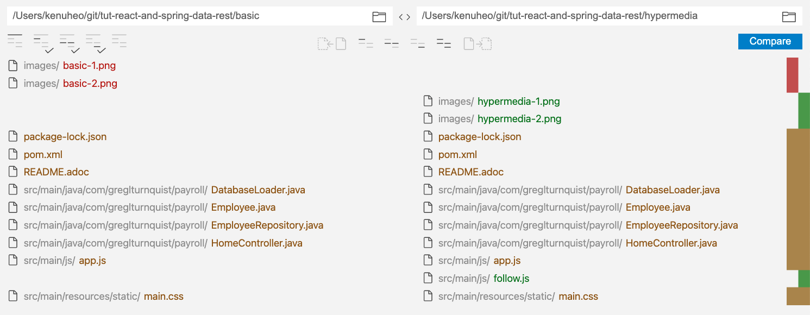
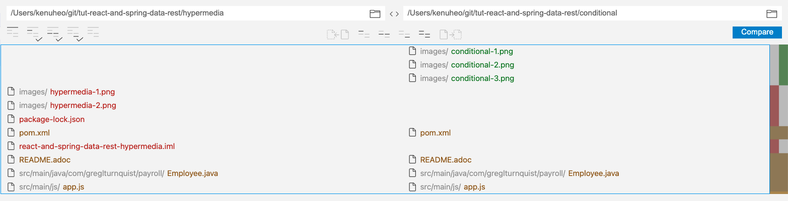
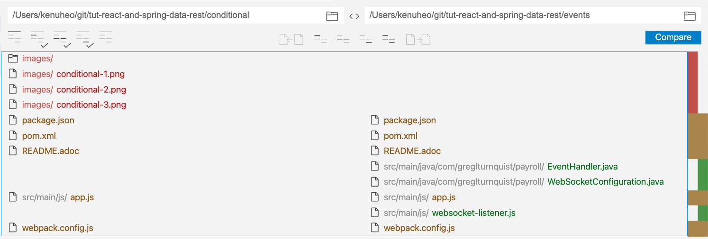
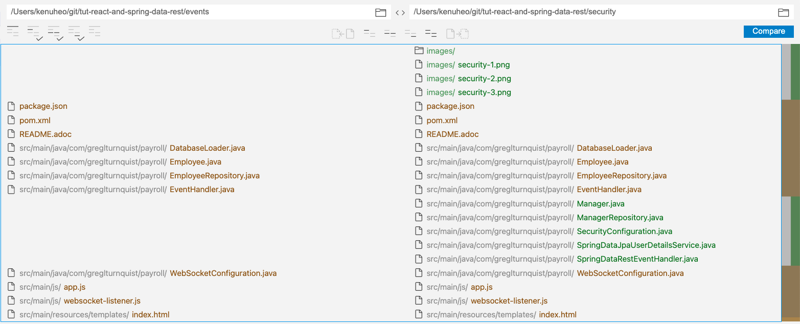

# Spring Boot + React.js
* Tutorial https://spring.io/guides/tutorials/react-and-spring-data-rest/
* Spring Data REST
* React.js
* Single Page Application

## Overview
* Repo: https://github.com/spring-guides/tut-react-and-spring-data-rest
* Java8, Maven
* Spring Boot Dependencies
  * Rest Repositories
  * Thymeleaf
  * JPA
  * H2
* React.js, ES6
  * https://ko.reactjs.org/
  * http://es6-features.org/
* Part 1~5
  * Part 1: 기본 세팅
  * Part 2: Hypermedia 제어
  * Part 3: 조건부 연산
  * Part 4: 웹소켓 이벤트
  * Part 5: UI 및 API 보안

## YouTube
* https://youtu.be/LAxaEBELods
* https://youtu.be/5b2Vn4kb22U
* https://youtu.be/fpJqx3j9p98
* https://youtu.be/hMUJzrxvl8g
* https://youtu.be/KrUbBiUgBvc

## Part 1
* `basic`: https://github.com/spring-guides/tut-react-and-spring-data-rest/tree/master/basic
* Spring Boot 프로젝트 만들기
  * HAL: Hypermedia Application Language
  * Rest Repositories HAL Explorer
  * `spring.data.rest.base-path=/api`
* frontend-maven-plugin 메이븐 플러그인
  * frontend-gradle-plugin 그래들 플러그인
  * node.js 빌드 지원
  * 운영으로는 비추천
    * https://github.com/eirslett/frontend-maven-plugin#what-is-this-plugin-meant-to-do

### React.js
* `react.js`: UI 개발 자바스크립트 라이브러리
* `rest.js`: REST call
* `webpack`: compile JS to bundle
* `babel`: ES6 -> ES5 for browser

### project package
* `package.json`: dependency for react.js project

```json
{
  "name": "spring-data-rest-and-reactjs",
  "version": "0.1.0",
  "description": "Demo of ReactJS + Spring Data REST",
  "repository": {
    "type": "git",
    "url": "git@github.com:spring-guides/tut-react-and-spring-data-rest.git"
  },
  "keywords": [
    "rest",
    "hateoas",
    "spring",
    "data",
    "react"
  ],
  "author": "Greg L. Turnquist",
  "license": "Apache-2.0",
  "bugs": {
    "url": "https://github.com/spring-guides/tut-react-and-spring-data-rest/issues"
  },
  "homepage": "https://github.com/spring-guides/tut-react-and-spring-data-rest",
  "dependencies": {
    "react": "^16.5.2",
    "react-dom": "^16.5.2",
    "rest": "^1.8.0"
  },
  "scripts": {
    "watch": "webpack --watch -d --output ./target/classes/static/built/bundle.js"
  },
  "devDependencies": {
    "@babel/core": "^7.1.0",
    "@babel/preset-env": "^7.1.0",
    "@babel/preset-react": "^7.0.0",
    "babel-loader": "^8.0.2",
    "webpack": "^4.19.1",
    "webpack-cli": "^3.1.0"
  }
}
```

* `webpack.config.js`: build tool for js

```json
var path = require('path');

module.exports = {
    entry: './src/main/js/app.js',
    devtool: 'sourcemaps',
    cache: true,
    mode: 'development',
    output: {
        path: __dirname,
        filename: './src/main/resources/static/built/bundle.js'
    },
    module: {
        rules: [
            {
                test: path.join(__dirname, '.'),
                exclude: /(node_modules)/,
                use: [{
                    loader: 'babel-loader',
                    options: {
                        presets: ["@babel/preset-env", "@babel/preset-react"]
                    }
                }]
            }
        ]
    }
};
```

### React Basic
```js
'use strict';

const React = require('react'); // <1>
const ReactDOM = require('react-dom'); // <2>
const client = require('./client'); // <3>

class App extends React.Component {

	constructor(props) {
		super(props);
		this.state = {employees: []};
	}

	componentDidMount() {
		client({method: 'GET', path: '/api/employees'}).done(response => {
			this.setState({employees: response.entity._embedded.employees});
		});
	}

	render() {
		return (
			<EmployeeList employees={this.state.employees}/>
		)
	}
}

class EmployeeList extends React.Component {
	render() {
		const employees = this.props.employees.map(employee =>
			<Employee key={employee._links.self.href} employee={employee}/>
		);
		return (
			<table>
				<tbody>
					<tr>
						<th>First Name</th>
						<th>Last Name</th>
						<th>Description</th>
					</tr>
					{employees}
				</tbody>
			</table>
		)
	}
}

class Employee extends React.Component {
	render() {
		return (
			<tr>
				<td>{this.props.employee.firstName}</td>
				<td>{this.props.employee.lastName}</td>
				<td>{this.props.employee.description}</td>
			</tr>
		)
	}
}

ReactDOM.render(
	<App />,
	document.getElementById('react')
)
```

## Part 2
* `hypermedia`: https://github.com/spring-guides/tut-react-and-spring-data-rest/tree/master/hypermedia
* If the engine of application state (and hence the API) is not being driven by hypertext, then it cannot be RESTful and cannot be a REST API. - Roy Fielding
* A key feature of REST is to include links to relevant resources. For example, if you were looking at an order, a RESTful API would include a link to the related customer, links to the catalog of items, and perhaps a link to the store from which the order was placed. In this section, you will introduce paging and see how to also use navigational paging links.
* `application/hal+json`, Spring Data REST’s default media type

### diff
* 

### Paging
```java
public interface EmployeeRepository extends PagingAndSortingRepository<Employee, Long> {
}
```

```
$ curl "localhost:8080/api/employees?size=2"
{
  "_links" : {
    "first" : {
      "href" : "http://localhost:8080/api/employees?page=0&size=2"
    },
    "self" : {
      "href" : "http://localhost:8080/api/employees"
    },
    "next" : {
      "href" : "http://localhost:8080/api/employees?page=1&size=2"
    },
    "last" : {
      "href" : "http://localhost:8080/api/employees?page=2&size=2"
    }
  },
  "_embedded" : {
    "employees" : [ {
      "firstName" : "Frodo",
      "lastName" : "Baggins",
      "description" : "ring bearer",
      "_links" : {
        "self" : {
          "href" : "http://localhost:8080/api/employees/1"
        }
      }
    }, {
      "firstName" : "Bilbo",
      "lastName" : "Baggins",
      "description" : "burglar",
      "_links" : {
        "self" : {
          "href" : "http://localhost:8080/api/employees/2"
        }
      }
    } ]
  },
  "page" : {
    "size" : 2,
    "totalElements" : 6,
    "totalPages" : 3,
    "number" : 0
  }
}
```

* default size: 20
* `first`, `next`, `last`
* `next` data

```
$ curl "http://localhost:8080/api/employees?page=1&size=2"
{
  "_links" : {
    "first" : {
      "href" : "http://localhost:8080/api/employees?page=0&size=2"
    },
    "prev" : {
      "href" : "http://localhost:8080/api/employees?page=0&size=2"
    },
    "self" : {
      "href" : "http://localhost:8080/api/employees"
    },
    "next" : {
      "href" : "http://localhost:8080/api/employees?page=2&size=2"
    },
    "last" : {
      "href" : "http://localhost:8080/api/employees?page=2&size=2"
    }
  },
...
```

* `curl http://localhost:8080/api/profile/employees -H "Accept:application/schema+json"`

```
{
  "title" : "Employee",
  "properties" : {
    "firstName" : {
      "title" : "First name",
      "readOnly" : false,
      "type" : "string"
    },
    "lastName" : {
      "title" : "Last name",
      "readOnly" : false,
      "type" : "string"
    },
    "description" : {
      "title" : "Description",
      "readOnly" : false,
      "type" : "string"
    }
  },
  "definitions" : { },
  "type" : "object",
  "$schema" : "https://json-schema.org/draft-04/schema#"
}
```

### Delete
```js
class Employee extends React.Component {

	constructor(props) {
		super(props);
		this.handleDelete = this.handleDelete.bind(this);
	}

	handleDelete() {
		this.props.onDelete(this.props.employee);
	}

	render() {
		return (
			<tr>
				<td>{this.props.employee.firstName}</td>
				<td>{this.props.employee.lastName}</td>
				<td>{this.props.employee.description}</td>
				<td>
					<button onClick={this.handleDelete}>Delete</button>
				</td>
			</tr>
		)
	}
}
```

```js
onDelete(employee) {
	client({method: 'DELETE', path: employee._links.self.href}).done(response => {
		this.loadFromServer(this.state.pageSize);
	});
}
```

### Page Size
```js
<input ref="pageSize" defaultValue={this.props.pageSize} onInput={this.handleInput}/>
```
* `ref="pageSize"`, `this.refs.pageSize`

```js
handleInput(e) {
	e.preventDefault();
	const pageSize = ReactDOM.findDOMNode(this.refs.pageSize).value;
	if (/^[0-9]+$/.test(pageSize)) {
		this.props.updatePageSize(pageSize);
	} else {
		ReactDOM.findDOMNode(this.refs.pageSize).value =
			pageSize.substring(0, pageSize.length - 1);
	}
}
```

```js
updatePageSize(pageSize) {
	if (pageSize !== this.state.pageSize) {
		this.loadFromServer(pageSize);
	}
}
```

## Part 3
* `conditional`: https://github.com/spring-guides/tut-react-and-spring-data-rest/tree/master/conditional
* Record Version, when inserting and updating
  * `javax.persistence.Version`
* Spring Data REST feature:
  * 리소스 버전
  * 프론트엔드 ETag

### diff
* 

### Version
```java
	private @Version @JsonIgnore Long version;
```

### Etag
```js
onUpdate(employee, updatedEmployee) {
	client({
		method: 'PUT',
		path: employee.entity._links.self.href,
		entity: updatedEmployee,
		headers: {
			'Content-Type': 'application/json',
			'If-Match': employee.headers.Etag
		}
	}).done(response => {
		this.loadFromServer(this.state.pageSize);
	}, response => {
		if (response.status.code === 412) {
			alert('DENIED: Unable to update ' +
				employee.entity._links.self.href + '. Your copy is stale.');
		}
	});
}
```
* `If-Match` header

## Part 4
* `events`: https://github.com/spring-guides/tut-react-and-spring-data-rest/tree/master/events
* Spring WebSocket

```xml
<dependency>
	<groupId>org.springframework.boot</groupId>
	<artifactId>spring-boot-starter-websocket</artifactId>
</dependency>
```

### diff
* 

```java
@Component
@EnableWebSocketMessageBroker
public class WebSocketConfiguration implements WebSocketMessageBrokerConfigurer {

	static final String MESSAGE_PREFIX = "/topic";

	@Override
	public void registerStompEndpoints(StompEndpointRegistry registry) {
		registry.addEndpoint("/payroll").withSockJS();
	}

	@Override
	public void configureMessageBroker(MessageBrokerRegistry registry) {
		registry.enableSimpleBroker(MESSAGE_PREFIX);
		registry.setApplicationDestinationPrefixes("/app");
	}
}
```
1. `@EnableWebSocketMessageBroker` WebSocket 시작.
2. `WebSocketMessageBrokerConfigurer` 기본 설정.
3. `MESSAGE_PREFIX` 모든 메시지 경로의 전치사.
4. `registerStompEndpoints()` `/payroll` 엔드포인트 설정.
5. `configureMessageBroker()` 메시지 브로커 설정.

### Java Event Handler
```java
@Component
@RepositoryEventHandler(Employee.class)
public class EventHandler {

	private final SimpMessagingTemplate websocket;

	private final EntityLinks entityLinks;

	@Autowired
	public EventHandler(SimpMessagingTemplate websocket, EntityLinks entityLinks) {
		this.websocket = websocket;
		this.entityLinks = entityLinks;
	}

	@HandleAfterCreate
	public void newEmployee(Employee employee) {
		this.websocket.convertAndSend(
				MESSAGE_PREFIX + "/newEmployee", getPath(employee));
	}

	@HandleAfterDelete
	public void deleteEmployee(Employee employee) {
		this.websocket.convertAndSend(
				MESSAGE_PREFIX + "/deleteEmployee", getPath(employee));
	}

	@HandleAfterSave
	public void updateEmployee(Employee employee) {
		this.websocket.convertAndSend(
				MESSAGE_PREFIX + "/updateEmployee", getPath(employee));
	}

	/**
	 * Take an {@link Employee} and get the URI using Spring Data REST's {@link EntityLinks}.
	 *
	 * @param employee
	 */
	private String getPath(Employee employee) {
		return this.entityLinks.linkForItemResource(employee.getClass(),
				employee.getId()).toUri().getPath();
	}

}
```
* `@RepositoryEventHandler(Employee.class)` 이벤트 기본 설정
* `SimpMessagingTemplate`, `EntityLinks` Autowired
* `@HandleXYZ`

### JavaScript WebSocket
```js
var stompClient = require('./websocket-listener')
```

## Part 5
* `security`: https://github.com/spring-guides/tut-react-and-spring-data-rest/tree/master/security
* Spring Security

```xml
<dependency>
	<groupId>org.springframework.boot</groupId>
	<artifactId>spring-boot-starter-security</artifactId>
</dependency>
<dependency>
	<groupId>org.thymeleaf.extras</groupId>
	<artifactId>thymeleaf-extras-springsecurity5</artifactId>
</dependency>
```

### diff
* 

```java
@Entity
public class Manager {

	public static final PasswordEncoder PASSWORD_ENCODER = new BCryptPasswordEncoder();

	private @Id @GeneratedValue Long id;

	private String name;

	private @JsonIgnore String password;

	private String[] roles;

	public void setPassword(String password) {
		this.password = PASSWORD_ENCODER.encode(password);
	}

	protected Manager() {}

	public Manager(String name, String password, String... roles) {

		this.name = name;
		this.setPassword(password);
		this.roles = roles;
	}

	@Override
	public boolean equals(Object o) {
		if (this == o) return true;
		if (o == null || getClass() != o.getClass()) return false;
		Manager manager = (Manager) o;
		return Objects.equals(id, manager.id) &&
			Objects.equals(name, manager.name) &&
			Objects.equals(password, manager.password) &&
			Arrays.equals(roles, manager.roles);
	}

	@Override
	public int hashCode() {

		int result = Objects.hash(id, name, password);
		result = 31 * result + Arrays.hashCode(roles);
		return result;
	}

	public Long getId() {
		return id;
	}

	public void setId(Long id) {
		this.id = id;
	}

	public String getName() {
		return name;
	}

	public void setName(String name) {
		this.name = name;
	}

	public String getPassword() {
		return password;
	}

	public String[] getRoles() {
		return roles;
	}

	public void setRoles(String[] roles) {
		this.roles = roles;
	}

	@Override
	public String toString() {
		return "Manager{" +
			"id=" + id +
			", name='" + name + '\'' +
			", roles=" + Arrays.toString(roles) +
			'}';
	}
}
```

### Manager
```java
@PreAuthorize("hasRole('ROLE_MANAGER')")
public interface EmployeeRepository extends PagingAndSortingRepository<Employee, Long> {

	@Override
	@PreAuthorize("#employee?.manager == null or #employee?.manager?.name == authentication?.name")
	Employee save(@Param("employee") Employee employee);

	@Override
	@PreAuthorize("@employeeRepository.findById(#id)?.manager?.name == authentication?.name")
	void deleteById(@Param("id") Long id);

	@Override
	@PreAuthorize("#employee?.manager?.name == authentication?.name")
	void delete(@Param("employee") Employee employee);

}
```

### Security Config
```java
@Configuration
@EnableWebSecurity
@EnableGlobalMethodSecurity(prePostEnabled = true)
public class SecurityConfiguration extends WebSecurityConfigurerAdapter {

	@Autowired
	private SpringDataJpaUserDetailsService userDetailsService;

	@Override
	protected void configure(AuthenticationManagerBuilder auth) throws Exception {
		auth
			.userDetailsService(this.userDetailsService)
				.passwordEncoder(Manager.PASSWORD_ENCODER);
	}

	@Override
	protected void configure(HttpSecurity http) throws Exception {
		http
			.authorizeRequests()
				.antMatchers("/built/**", "/main.css").permitAll()
				.anyRequest().authenticated()
				.and()
			.formLogin()
				.defaultSuccessUrl("/", true)
				.permitAll()
				.and()
			.httpBasic()
				.and()
			.csrf().disable()
			.logout()
				.logoutSuccessUrl("/");
	}

}
```

## ref
* https://spring.io/guides/tutorials/react-and-spring-data-rest/
