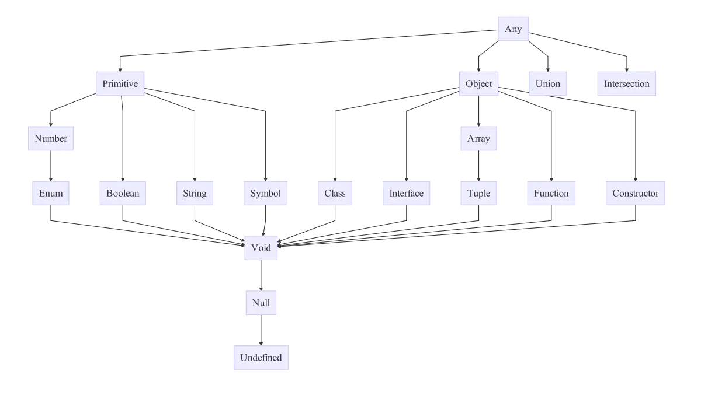

# TypeScript
- https://www.typescriptlang.org/
- Current version: 5.x
- Superset of JavaScript that adds static types

## Example
- `greeter.ts`

```typescript
// Modern TypeScript example with type annotations
function greeter(person: string): string {
  return `Hello, ${person}`;  // Template string
}

// Type inference (TypeScript knows 'user' is a string)
const user = "Kenu";

console.log(greeter(user));
```

## Install, Compile and Run
- `npm install -g typescript` (installs the latest version globally)
- `tsc greeter.ts` (compiles TypeScript to JavaScript)
- `node greeter.js` (runs the compiled JavaScript)

## Quick Execution with ts-node
- `npm i -g ts-node` (installs ts-node globally)
- `ts-node greeter.ts` (compiles and runs TypeScript in one step)

## Project Setup (Recommended)
```bash
# Initialize a TypeScript project
npm init -y
npm install typescript --save-dev
npx tsc --init # Creates tsconfig.json
```

### tsconfig.json (Basic Configuration)
```json
{
  "compilerOptions": {
    "target": "ES2020",
    "module": "NodeNext",
    "moduleResolution": "NodeNext",
    "strict": true,
    "esModuleInterop": true,
    "skipLibCheck": true,
    "forceConsistentCasingInFileNames": true
  }
}
```

## TypeScript Type 계층도

- image from: https://github.com/bcherny/language-types-comparison

## Object Oriented Programming
- 객체 지향 프로그래밍
- SOLID Principles in TypeScript
  - SRP (단일책임의 원칙: Single Responsibility Principle)
  - OCP (개방폐쇄의 원칙: Open Close Principle)
  - LSP (리스코브 치환의 원칙: The Liskov Substitution Principle)
  - ISP (인터페이스 분리의 원칙: Interface Segregation Principle)
  - DIP (의존성역전의 원칙: Dependency Inversion Principle)
- See: https://www.digitalocean.com/community/conceptual-articles/s-o-l-i-d-the-first-five-principles-of-object-oriented-design

- 풀어서 얘기하자면(#그래도 #어려움)
  - 어떤 변화에 의해 클래스를 변경해야 하는 이유는 오직 하나뿐이어야 함
  - 소프트웨어의 구성요소(컴포넌트, 클래스, 모듈, 함수)는 확장에는 열려있고, 변경에는 닫혀있어야 한다는 원리
  - 서브 타입은 언제나 기반 타입으로 교체할 수 있어야 한다.
  - 한 클래스는 자신이 사용하지 않는 인터페이스는 구현하지 말아야 한다는 원리
  - 실제 사용 관계는 바뀌지 않으며, 추상을 매개로 메시지를 주고 받음으로써 관계를 최대한 느슨하게 만드는 원칙

## Object
- 객체란 속성과 행동을 포함
- 속성 : state, property, attribute, field, member variable
  - 상태를 저장
  - Car : 검은색, 바퀴수4개
- 행동 : behavior, method, function
  - 기능을 수행함
  - 매개변수를 인자로 받음 _f(x)_
  - 차 : 가속하다(), 멈추다()

## 클래스와 인스턴스
- 클래스는 도장(Type)과 같음. 청사진
- 인스턴스는 종이(메모리)위에 찍힌 도장자국과 같음
- `new` 키워드 사용해서 메모리 위치 정해줌
- `Car car = new Car();`
- 클래스에 `()`이 붙은 것을 생성자(Constructor)라고 함
- 인스턴스는 변수와 같은 역할 == 쓰고 버릴 수도 있음(메모리 해제)

## TypeScript Class
- 전통적인 JavaScript는 재사용 가능한 컴포넌트를 만들기 위해 함수와 프로토타입 기반의 상속을 사용
- TypeScript는 클래스, 인터페이스 및 모듈과 같은 객체 지향 개념을 제공

### 클래스 예제 (Modern TypeScript)

```ts
class Greeter {
  // Modern property declaration with access modifier
  private readonly greeting: string;
  
  constructor(message: string) {
    this.greeting = message;
  }
  
  // Method with return type annotation
  greet(): string {
    return `Hello, ${this.greeting}`;
  }
}

// Use const for object references that won't be reassigned
const greeter = new Greeter("world");
console.log(greeter.greet());
```
- Official docs: https://www.typescriptlang.org/docs/handbook/2/classes.html

## 상속 (Inheritance)
- 기존 클래스 확장
- 키워드 : `extends`, `super`
- `Child extends Papa`

## 재정의 (Override)
- 부모의 함수 재정의

## 오버로딩 (Overloads)
- 다양한 인수를 받는 함수 선언 가능
- 저글링 8마리 = 히드라 4마리 = 울트라리스크 2마리
- 함수별 구현 안됨 ㅠㅠ

```ts
let suits = ["hearts", "spades", "clubs", "diamonds"];

function pickCard(x: {suit: string; card: number; }[]): number;
function pickCard(x: number): {suit: string; card: number; };
function pickCard(x): any {
  // Check to see if we're working with an object/array
  // if so, they gave us the deck and we'll pick the card
  if (typeof x == "object") {
    let pickedCard = Math.floor(Math.random() * x.length);
    return pickedCard;
  }
  // Otherwise just let them pick the card
  else if (typeof x == "number") {
    let pickedSuit = Math.floor(x / 13);
    return { suit: suits[pickedSuit], card: x % 13 };
  }
}
```


## 지정자 (Modifier)
- `public`, `private`, `protected`
- `readonly` : 매개변수 프로퍼티

```ts
class Octopus {
  readonly numberOfLegs: number = 8;
  constructor(readonly name: string) {
  }
}
```

## 접근자 (Accessors)

- getter/setter
- TypeScript 4.3+ 지원 getter/setter의 다른 타입 지원

```ts
// Modern implementation with class field initialization
const passcode = "secret passcode";

class Employee {
  // Initialized with undefined
  private _fullName: string = '';

  get fullName(): string {
    return this._fullName;
  }

  set fullName(newName: string) {
    if (passcode === "secret passcode") {
      this._fullName = newName;
    }
    else {
      console.log("오류 : employee의 무단 업데이트!");
    }
  }
}

const employee = new Employee();
employee.fullName = "Bob Smith";
if (employee.fullName) {
    console.log(employee.fullName);
}
```

## 정적 프로퍼티 (Static Properties)
- `this`가 아닌 클래스에서 바로 접근. `Grid.origin.x`

```ts
class Grid {
  static origin = {x: 0, y: 0};
  calculateDistanceFromOrigin(point: {x: number; y: number;}) {
    let xDist = (point.x - Grid.origin.x);
    let yDist = (point.y - Grid.origin.y);
    return Math.sqrt(xDist * xDist + yDist * yDist) / this.scale;
  }
  constructor (public scale: number) { }
}
```

## 추상 클래스 (Abstract Classes)
- interface(구현 안된 함수 `{}` 부분이 없는 함수)를 포함한 클래스
- `new` 사용 안됨
- 상속해서 구현해야 사용할 수 있음

## Symbol Type
- `let greeterMaker: typeof Greeter = Greeter;`
- 인스턴스 타입이 아닌 "`Greeter` 클래스 자체의 타입을 제공"
  - 생성자 함수의 타입인 "`Greeter`라는 Symbol 타입을 제공"

## Modern TypeScript Features

### Type Aliases and Interfaces
```ts
// Type Alias
type Point = {
  x: number;
  y: number;
};

// Interface
interface User {
  id: number;
  name: string;
}

// Extending interfaces
interface Employee extends User {
  department: string;
}
```

### Union and Intersection Types
```ts
// Union type (either string or number)
function printId(id: string | number) {
  console.log(`ID: ${id}`);
}

// Intersection type (both types)
type Employee = Person & { employeeId: number };
```

### Nullish Coalescing and Optional Chaining
```ts
// Nullish coalescing (??)
const userName = response.user?.name ?? "Anonymous";

// Optional chaining (?.)
const street = user?.address?.street;
```

### Utility Types
```ts
// Partial - Makes all properties optional
type PartialUser = Partial<User>;

// Pick - selects a subset of properties
type UserName = Pick<User, 'name'>;

// Omit - removes properties
type UserWithoutId = Omit<User, 'id'>;

// Record - creates a type with specified properties
type UserRoles = Record<string, User>;
```

## ref
- Official Documentation
  - https://www.typescriptlang.org/docs/
- TypeScript Handbook
  - https://www.typescriptlang.org/docs/handbook/intro.html
- TypeScript Deep Dive
  - https://basarat.gitbook.io/typescript/
- TypeScript Playground
  - https://www.typescriptlang.org/play
